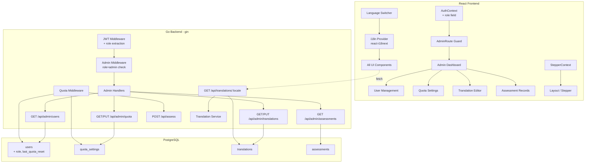

# Design Document: Admin, Quota & i18n

## Overview

This feature extends the SAFE-AI Excel Brushing Tool with three interconnected modules:

1. **Role-based Admin System** — Adds a `role` field to users, role-aware JWT tokens, admin middleware, and a `/admin` dashboard with user management and assessment record views.
2. **Assessment Quota Management** — Implements per-user quota enforcement with lazy reset (daily/weekly), configurable by admin. No background jobs — reset is evaluated on each API call.
3. **Internationalization (i18n)** — Frontend uses `react-i18next` with translations loaded from a backend API (stored in PostgreSQL). A bundled fallback JSON ensures the app works offline. An admin translation editor enables live updates without redeployment.

### Design Decisions

| Decision | Rationale |
|----------|-----------|
| Role in JWT payload | Avoids a DB lookup on every admin route check; role changes require re-login |
| Lazy quota reset | No cron/background worker needed; simpler infrastructure, evaluated per-request |
| Translations in DB + API | Enables admin live editing; bundled fallback ensures resilience |
| `react-i18next` | De-facto standard for React i18n; namespace support, lazy loading, interpolation |
| Single `quota_settings` row | Global settings are simpler than per-user overrides for MVP |
| Frontend stepper state in React Context + localStorage | No backend change needed; survives page refresh |

---

## Architecture



---

## Components and Interfaces

### Backend Components

#### 1. Admin Package (`internal/admin`)

New package handling all admin-specific routes.

```go
// internal/admin/handler.go
type Handler struct {
    userRepo    *auth.Repository
    quotaRepo   *QuotaRepository
    transRepo   *TranslationRepository
    assessRepo  *assessment.Repository
}

// GET /api/admin/users?page=1&page_size=20
func (h *Handler) ListUsers(c *gin.Context)

// GET /api/admin/quota
func (h *Handler) GetQuotaSettings(c *gin.Context)

// PUT /api/admin/quota
func (h *Handler) UpdateQuotaSettings(c *gin.Context)

// GET /api/admin/translations?locale=zh-TW&search=keyword&page=1
func (h *Handler) ListTranslations(c *gin.Context)

// PUT /api/admin/translations/:id
func (h *Handler) UpdateTranslation(c *gin.Context)

// GET /api/admin/assessments?user_id=uuid&page=1&page_size=20
func (h *Handler) ListAssessments(c *gin.Context)
```

#### 2. Quota Package (`internal/quota`)

Handles quota enforcement with lazy reset logic.

```go
// internal/quota/service.go
type Service struct {
    quotaRepo *Repository
    userRepo  *auth.Repository
}

// CheckAndConsume checks if user has remaining quota (with lazy reset).
// Returns (allowed bool, remaining int, err error)
func (s *Service) CheckAndConsume(ctx context.Context, userID uuid.UUID) (bool, int, error)

// GetUserQuotaInfo returns current quota status for a user.
func (s *Service) GetUserQuotaInfo(ctx context.Context, userID uuid.UUID) (*QuotaInfo, error)

// internal/quota/repository.go
type Repository struct {
    pool *pgxpool.Pool
}

func (r *Repository) GetSettings(ctx context.Context) (*Settings, error)
func (r *Repository) UpdateSettings(ctx context.Context, s *Settings) error
func (r *Repository) GetUsageCount(ctx context.Context, userID uuid.UUID, since time.Time) (int, error)
func (r *Repository) IncrementUsage(ctx context.Context, userID uuid.UUID) error
func (r *Repository) ResetUser(ctx context.Context, userID uuid.UUID, resetTime time.Time) error
```

#### 3. Translation Package (`internal/translation`)

Manages translation key-value pairs.

```go
// internal/translation/service.go
type Service struct {
    repo *Repository
}

func (s *Service) GetByLocale(ctx context.Context, locale string) (map[string]string, error)
func (s *Service) Update(ctx context.Context, id uuid.UUID, value string) error
func (s *Service) Search(ctx context.Context, locale, query string, page, pageSize int) ([]Translation, int, error)

// internal/translation/repository.go
type Repository struct {
    pool *pgxpool.Pool
}

func (r *Repository) FindByLocale(ctx context.Context, locale string) ([]Translation, error)
func (r *Repository) FindByID(ctx context.Context, id uuid.UUID) (*Translation, error)
func (r *Repository) Update(ctx context.Context, id uuid.UUID, value string) error
func (r *Repository) Search(ctx context.Context, locale, query string, offset, limit int) ([]Translation, int, error)
```

#### 4. Admin Middleware (`internal/middleware/admin.go`)

```go
// AdminAuth checks that the JWT contains role="admin".
// Must be placed AFTER JWTAuth middleware.
func AdminAuth() gin.HandlerFunc
```

#### 5. Updated JWT (changes to `internal/auth`)

```go
// GenerateToken updated signature — adds role claim
func GenerateToken(userID uuid.UUID, role, secret string, expiry time.Duration) (string, time.Time, error)

// ValidateToken updated — returns userID and role
func ValidateToken(tokenString, secret string) (uuid.UUID, string, error)
```

The existing `JWTAuth` middleware will be updated to extract the `role` claim and set it in the gin context as `c.Set("user_role", role)`.

#### 6. Public Translation Endpoint

```go
// GET /api/translations/:locale (public, no auth required)
// Returns {"translations": {"key": "value", ...}}
```

### Frontend Components

#### 1. i18n Setup (`src/i18n/`)

```
src/i18n/
├── index.ts          # i18next initialization + backend plugin
├── fallback/
│   ├── zh-TW.json   # bundled fallback translations
│   └── en.json      # bundled fallback translations
```

Uses `react-i18next` with a custom backend that fetches from `/api/translations/:locale`, falling back to bundled JSON on failure.

#### 2. AuthContext Update

```typescript
interface User {
  id: string
  email: string
  role: 'admin' | 'user'  // NEW
}
```

The `/auth/me` response and JWT decode will include `role`.

#### 3. StepperContext (`src/contexts/StepperContext.tsx`)

```typescript
interface StepperState {
  maxReachedStep: number      // highest step index reached
  completedSteps: boolean[]   // per-step completion status
  stepData: Record<number, unknown>  // cached step results
}

interface StepperContextType extends StepperState {
  markComplete: (step: number) => void
  setStepData: (step: number, data: unknown) => void
  canNavigateTo: (step: number) => boolean
}
```

Persisted to `localStorage` under key `stepper_state`.

#### 4. Admin Pages (`src/pages/admin/`)

```
src/pages/admin/
├── AdminLayout.tsx       # Admin sub-layout with sidebar nav
├── UsersPage.tsx         # User list + quota info
├── QuotaSettingsPage.tsx # Edit max_assessments & reset_period
├── TranslationsPage.tsx  # Translation editor with search
└── AssessmentRecordsPage.tsx  # Per-user assessment history
```

#### 5. AdminRoute Guard (`src/components/AdminRoute.tsx`)

```typescript
// Wraps children; redirects to '/' with toast if role !== 'admin'
function AdminRoute({ children }: { children: ReactNode }): JSX.Element
```

#### 6. Language Switcher (`src/components/LanguageSwitcher.tsx`)

A toggle button in the header that switches between zh-TW and en.

---

## Data Models

### Database Schema Changes (Migration 003)

```sql
-- Migration: 003_admin_quota_i18n
-- Description: Add role, quota, and translations support

-- 1. Add role to users
ALTER TABLE users ADD COLUMN role VARCHAR(10) NOT NULL DEFAULT 'user'
  CHECK (role IN ('admin', 'user'));

-- 2. Add last_quota_reset to users
ALTER TABLE users ADD COLUMN last_quota_reset TIMESTAMP WITH TIME ZONE DEFAULT NOW();

-- 3. Create quota_settings table
CREATE TABLE IF NOT EXISTS quota_settings (
    id UUID PRIMARY KEY DEFAULT gen_random_uuid(),
    max_assessments INTEGER NOT NULL DEFAULT 5 CHECK (max_assessments >= 1),
    reset_period VARCHAR(10) NOT NULL DEFAULT 'daily' CHECK (reset_period IN ('daily', 'weekly')),
    updated_at TIMESTAMP WITH TIME ZONE DEFAULT NOW()
);

-- Insert default quota settings
INSERT INTO quota_settings (max_assessments, reset_period)
VALUES (5, 'daily');

-- 4. Create translations table
CREATE TABLE IF NOT EXISTS translations (
    id UUID PRIMARY KEY DEFAULT gen_random_uuid(),
    locale VARCHAR(10) NOT NULL,
    key VARCHAR(255) NOT NULL,
    value TEXT NOT NULL DEFAULT '',
    updated_at TIMESTAMP WITH TIME ZONE DEFAULT NOW()
);

-- Unique index on (locale, key)
CREATE UNIQUE INDEX idx_translations_locale_key ON translations(locale, key);

-- Index for locale-based lookups
CREATE INDEX idx_translations_locale ON translations(locale);
```

### Go Structs

```go
// internal/quota/model.go
type Settings struct {
    ID             uuid.UUID `json:"id"`
    MaxAssessments int       `json:"max_assessments"`
    ResetPeriod    string    `json:"reset_period"` // "daily" | "weekly"
    UpdatedAt      time.Time `json:"updated_at"`
}

type QuotaInfo struct {
    MaxAssessments int       `json:"max_assessments"`
    UsedCount      int       `json:"used_count"`
    Remaining      int       `json:"remaining"`
    ResetPeriod    string    `json:"reset_period"`
    NextReset      time.Time `json:"next_reset"`
}

// internal/translation/model.go
type Translation struct {
    ID        uuid.UUID `json:"id"`
    Locale    string    `json:"locale"`
    Key       string    `json:"key"`
    Value     string    `json:"value"`
    UpdatedAt time.Time `json:"updated_at"`
}
```

### API Request/Response Shapes

```typescript
// PUT /api/admin/quota
interface UpdateQuotaRequest {
  max_assessments: number  // positive integer
  reset_period: 'daily' | 'weekly'
}

// GET /api/admin/users?page=1&page_size=20
interface UserListResponse {
  users: Array<{
    id: string
    email: string
    role: string
    used_count: number
    remaining: number
  }>
  total: number
  page: number
  page_size: number
}

// GET /api/admin/assessments?user_id=uuid&page=1
interface AssessmentListResponse {
  assessments: Array<{
    id: string
    filename: string
    total_score: number
    status: string
    created_at: string
  }>
  total: number
  page: number
  page_size: number
}

// GET /api/translations/:locale
interface TranslationsResponse {
  translations: Record<string, string>
}

// GET /api/admin/translations?locale=zh-TW&search=btn&page=1
interface AdminTranslationsResponse {
  translations: Array<{
    id: string
    locale: string
    key: string
    value: string
    updated_at: string
  }>
  total: number
  page: number
  page_size: number
}

// PUT /api/admin/translations/:id
interface UpdateTranslationRequest {
  value: string
}
```

### Lazy Quota Reset Algorithm

```
function checkAndConsume(userID):
    settings = getQuotaSettings()          // cached or from DB
    user = getUser(userID)
    
    resetNeeded = false
    if settings.reset_period == "daily":
        todayMidnight = today at 00:00 UTC+8
        if user.last_quota_reset < todayMidnight:
            resetNeeded = true
    elif settings.reset_period == "weekly":
        thisMonday = most recent Monday at 00:00 UTC+8
        if user.last_quota_reset < thisMonday:
            resetNeeded = true
    
    if resetNeeded:
        user.last_quota_reset = now
        // reset effectively happens by counting only assessments since last_quota_reset
    
    usedCount = countAssessmentsSince(userID, user.last_quota_reset)
    
    if usedCount >= settings.max_assessments:
        return (denied, 0)
    
    // Allow and increment
    return (allowed, settings.max_assessments - usedCount - 1)
```

The "used count" is derived by counting assessment records created since `last_quota_reset`, not a separate counter column. This eliminates drift between the counter and actual records.

---

## Correctness Properties

*A property is a characteristic or behavior that should hold true across all valid executions of a system — essentially, a formal statement about what the system should do. Properties serve as the bridge between human-readable specifications and machine-verifiable correctness guarantees.*

### Property 1: Registration assigns default role

*For any* valid registration request (valid email + password), the created user record SHALL have `role = 'user'`.

**Validates: Requirements 1.2**

### Property 2: JWT role round-trip

*For any* user with a role value in {'admin', 'user'}, generating a JWT token and then validating it SHALL return the same role value that was stored in the database.

**Validates: Requirements 1.3**

### Property 3: Admin middleware rejects non-admin

*For any* admin-protected API endpoint and *for any* request bearing a valid JWT with `role = 'user'`, the system SHALL respond with HTTP 403 and an error message containing "權限不足".

**Validates: Requirements 2.3, 2.4**

### Property 4: Pagination invariant

*For any* paginated list endpoint (users or assessment records) with total count N, the page response SHALL contain at most `page_size` items (default 20), and iterating all pages SHALL yield exactly N distinct records with no duplicates or gaps.

**Validates: Requirements 3.2, 7.3**

### Property 5: Quota settings round-trip

*For any* valid quota settings update (max_assessments ≥ 1, reset_period ∈ {'daily', 'weekly'}), saving and then reading the settings SHALL return identical values.

**Validates: Requirements 4.2**

### Property 6: Invalid quota settings rejected

*For any* quota settings where max_assessments < 1 OR reset_period ∉ {'daily', 'weekly'}, the update API SHALL respond with HTTP 400.

**Validates: Requirements 4.4**

### Property 7: Assessment increments quota usage

*For any* user with remaining quota > 0, after successfully running an assessment, the used count SHALL equal the previous used count + 1.

**Validates: Requirements 5.1**

### Property 8: Quota limit enforcement

*For any* user whose used count equals max_assessments within the current reset period, an assessment request SHALL be rejected with HTTP 403 and message "評估次數已用盡，請聯繫管理員".

**Validates: Requirements 5.2**

### Property 9: Quota lazy reset

*For any* user with exhausted quota whose `last_quota_reset` timestamp is before the current period boundary (daily: today 00:00 UTC+8; weekly: this Monday 00:00 UTC+8), the next assessment request SHALL succeed because the quota is reset before enforcement.

**Validates: Requirements 6.1, 6.2, 6.3, 6.4**

### Property 10: Assessment records ordered descending

*For any* set of assessment records returned by the admin API, the `created_at` timestamps SHALL be in strictly non-increasing order.

**Validates: Requirements 7.2**

### Property 11: Stepper navigation constraint

*For any* stepper progress state with `maxReachedStep = M`, all steps with index ≤ M SHALL be navigable (clickable), and all steps with index > M SHALL be disabled.

**Validates: Requirements 9.1, 9.3**

### Property 12: Translation lookup correctness

*For any* translation key K and locale L ∈ {'zh-TW', 'en'}, calling the translation function `t(K)` while the active locale is L SHALL return the value stored for (L, K) in the translation data source.

**Validates: Requirements 10.3**

### Property 13: Translation API completeness

*For any* locale L ∈ {'zh-TW', 'en'}, the GET `/api/translations/:locale` endpoint SHALL return a map containing all translation keys that exist for that locale, with non-empty values.

**Validates: Requirements 12.1**

### Property 14: Translation update round-trip

*For any* translation record with ID and a new non-empty value string V, calling PUT to update and then GET to read back SHALL return value = V.

**Validates: Requirements 13.2**

### Property 15: Translation search filter

*For any* search query string Q and locale L, all results returned by the translation search endpoint SHALL contain Q as a substring of either the `key` field or the `value` field (case-insensitive).

**Validates: Requirements 13.4**

### Property 16: Translation unique constraint

*For any* (locale, key) pair that already exists in the translations table, attempting to insert a second record with the same (locale, key) SHALL fail with a unique constraint error.

**Validates: Requirements 14.5**

---

## Error Handling

| Scenario | HTTP Status | Error Code | Message |
|----------|-------------|------------|---------|
| Non-admin accessing admin API | 403 | `FORBIDDEN` | 權限不足 |
| Quota exhausted | 403 | `QUOTA_EXCEEDED` | 評估次數已用盡，請聯繫管理員 |
| Invalid quota settings | 400 | `VALIDATION_ERROR` | 配額設定無效：max_assessments 必須為正整數，reset_period 必須為 daily 或 weekly |
| Translation not found | 404 | `NOT_FOUND` | 翻譯項目不存在 |
| Invalid locale | 400 | `VALIDATION_ERROR` | 不支援的語系，僅支援 zh-TW 與 en |
| Translation API unavailable | — | — | Frontend silently falls back to bundled JSON |
| JWT missing role claim | 401 | `AUTH_ERROR` | 無效的認證令牌 |

### Frontend Error Handling

- **Quota exceeded**: UploadPage disables the "開始評估" button and shows a tooltip. A banner may also appear at the top.
- **Admin route unauthorized**: Redirect to `/landing` with a toast notification "無權限存取".
- **Translation API failure**: `react-i18next` falls back to bundled JSON files transparently — no user-visible error.
- **Stale JWT (role changed)**: On 403 from admin endpoints after a role downgrade, prompt re-login.

---

## Testing Strategy

### Property-Based Tests (Backend — Go)

Library: **pgregory.net/rapid** (already used in the project)

Configuration: Minimum 100 iterations per property. Each test tagged with the design property reference.

Tests to implement:
- **Property 2**: Generate random (userID, role) pairs → `GenerateToken` → `ValidateToken` → assert role matches
- **Property 3**: Generate random admin endpoint paths + user JWT with role='user' → send request → assert 403
- **Property 5**: Generate random valid (max_assessments ∈ [1,1000], reset_period ∈ {'daily','weekly'}) → save → read → assert equality
- **Property 6**: Generate random invalid settings (max_assessments ≤ 0 or arbitrary strings for period) → assert 400
- **Property 7**: Generate random user states with remaining > 0 → run assessment → assert count+1
- **Property 8**: Set user at limit → attempt assessment → assert 403
- **Property 9**: Generate random (last_reset before boundary, period, now after boundary) → attempt → assert success
- **Property 10**: Generate random assessment timestamps → insert → query → assert descending order
- **Property 14**: Generate random (key, locale, value) → update → read → assert match
- **Property 15**: Generate random search strings + translation datasets → search → assert all results contain query
- **Property 16**: Generate random (locale, key) → insert twice → assert second fails

### Property-Based Tests (Frontend — TypeScript)

Library: **fast-check** (already in devDependencies)

Tests to implement:
- **Property 11**: Generate random maxReachedStep (0-7) → verify canNavigateTo returns true for ≤ M, false for > M
- **Property 12**: Generate random translation maps + locale + key → verify t() returns correct value

### Unit Tests (Example-Based)

- Registration creates user with role='user'
- Login returns JWT with role in payload
- Admin sees nav link; non-admin does not
- Default quota settings (5, 'daily')
- Stepper read-only mode for completed steps
- Language switcher persists to localStorage
- Fallback translations load when API fails
- Translation editor search filters correctly

### Integration Tests

- Full flow: register → login → hit admin endpoint → 403
- Promote user to admin → hit admin endpoint → 200
- Exhaust quota → 403 → wait for reset → 200
- Update translation via admin → public endpoint reflects change

### Smoke Tests

- Migration runs without error
- All new tables and columns exist after migration
- Default quota_settings row is inserted
- i18n initializes with zh-TW as default locale
