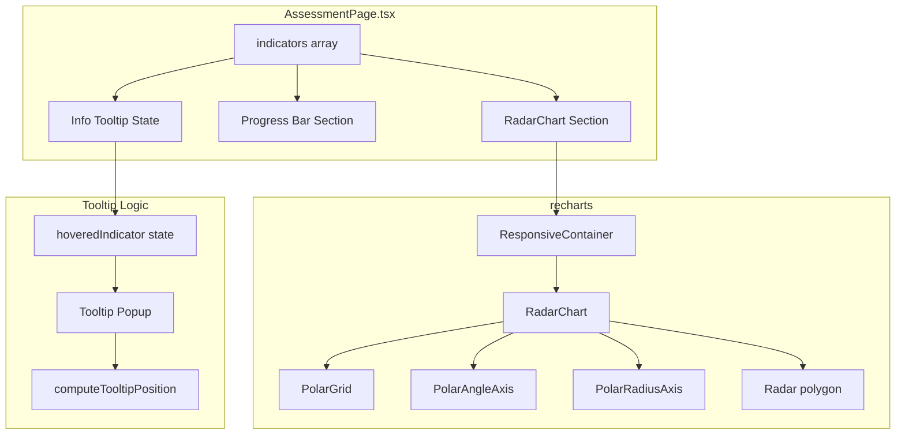

# Design Document: Assessment Radar Chart

## Overview

本設計為 AssessmentPage 評估指標區段新增三項 UI 增強功能：

1. **雷達圖（Radar Chart）**：在「六項評估指標」標題下方、指標進度條上方，使用 recharts `RadarChart` 繪製六軸多邊形圖表，讓使用者一眼掌握整體品質輪廓。
2. **資訊圖示與 Tooltip**：每項指標名稱旁新增 ⓘ 圖示，hover 時顯示浮動提示框說明指標意義與計算方式。
3. **指標重新命名**：將「重複/近似 / Duplicate/Similar」更名為「資料唯一性 / Data Uniqueness」，使高分更直觀代表正面意義。

所有變更皆在 `frontend/src/pages/AssessmentPage.tsx` 單一檔案內完成，不需安裝新套件、不需修改後端。

## Architecture



### Design Decisions

1. **單一檔案修改**：所有變更集中在 `AssessmentPage.tsx`，因為此功能範圍小且元件尚未拆分。Tooltip 定位邏輯如需測試可抽為 utility function。
2. **使用 ResponsiveContainer**：recharts 的 `ResponsiveContainer` 確保雷達圖在不同螢幕尺寸下自適應。
3. **CSS-only tooltip with state fallback**：tooltip 使用 `useState` 追蹤 hover 狀態，以 inline style 定位。選擇不引入額外 tooltip library 以保持一致性。
4. **Tooltip 定位函式可抽取**：將 tooltip 位置計算抽為純函式 `computeTooltipPosition`，便於單元測試。

## Components and Interfaces

### 1. RadarChart Section

位置：「六項評估指標」`<h3>` 下方，與進度條並排 — 使用 `display: flex` 佈局，左側為 indicators progress bars（flex: 1），右側為 RadarChart（固定寬度 280px）。

```tsx
<div style={{ display: 'flex', gap: 24, alignItems: 'flex-start' }}>
  {/* Left: progress bars */}
  <div style={{ flex: 1 }}>
    {indicators.map(...)}
  </div>
  {/* Right: radar chart */}
  <div style={{ width: 280, flexShrink: 0 }}>
    <ResponsiveContainer width="100%" height={260}>
      ...
    </ResponsiveContainer>
  </div>
</div>
```

```tsx
import { RadarChart, Radar, PolarGrid, PolarAngleAxis, PolarRadiusAxis, ResponsiveContainer } from 'recharts'

// Data transform for recharts
const radarData = indicators.map(ind => ({
  subject: ind.name,
  score: ind.score,
}))
```

Props 配置：
- `RadarChart`: `cx="50%" cy="50%" outerRadius="80%"`
- `PolarGrid`: 預設格線
- `PolarAngleAxis`: `dataKey="subject"` 顯示中文名
- `PolarRadiusAxis`: `domain={[0, 100]}`, `tick={false}` 隱藏刻度數字保持簡潔
- `Radar`: `dataKey="score"`, `fill="var(--accent)"`, `fillOpacity={0.35}`, `stroke="var(--accent)"`, `strokeWidth={2}`

容器尺寸：`ResponsiveContainer width="100%" height={260}`，外層固定 280px 寬度

### 2. Info Tooltip

#### State

```tsx
const [hoveredIndicator, setHoveredIndicator] = useState<string | null>(null)
```

#### Tooltip Content Map

```tsx
const indicatorInfo: Record<string, { desc: string; calc: string }> = {
  '列完整度': {
    desc: '衡量每列資料的填寫比例',
    calc: '每列非空格數 ÷ 總欄數的平均值 × 100',
  },
  '欄完整度': {
    desc: '衡量每欄資料的填寫比例',
    calc: '每欄非空值數 ÷ 總列數的平均值 × 100',
  },
  '格式一致性': {
    desc: '衡量每欄內資料格式的統一程度',
    calc: '每欄主要格式佔比的平均值 × 100',
  },
  '資料唯一性': {
    desc: '衡量資料中重複或近似列的稀少程度',
    calc: '(1 − 重複列比例) × 100',
  },
  '表格結構': {
    desc: '衡量表格結構是否乾淨規整',
    calc: '依據合併儲存格、多層表頭、小計列等問題各扣分',
  },
  'AI 問答可用性': {
    desc: '衡量資料是否適合 AI 查詢分析',
    calc: '依據 ID 欄、時間欄、分類欄、數值欄、欄名品質各加 20 分',
  },
}
```

#### ⓘ Icon Markup

在每個 indicator bar row 的名稱 `<div>` 內，中文名稱後方插入：

```tsx
<span
  onMouseEnter={() => setHoveredIndicator(ind.name)}
  onMouseLeave={() => setHoveredIndicator(null)}
  style={{ cursor: 'pointer', marginLeft: 4, color: 'var(--ink-faint)', fontSize: 12 }}
>
  ⓘ
</span>
```

#### Tooltip Popup

當 `hoveredIndicator === ind.name` 時，於該 row 內以 `position: absolute` 顯示：

```tsx
{hoveredIndicator === ind.name && (
  <div style={{
    position: 'absolute', top: -8, left: 170,
    background: 'var(--panel)', border: '1px solid var(--line)',
    borderRadius: 8, padding: '10px 14px', fontSize: 12,
    boxShadow: '0 4px 12px rgba(0,0,0,0.08)', zIndex: 10,
    minWidth: 220, maxWidth: 300,
  }}>
    <div style={{ fontWeight: 600, marginBottom: 4 }}>{indicatorInfo[ind.name]?.desc}</div>
    <div style={{ color: 'var(--ink-faint)' }}>計算：{indicatorInfo[ind.name]?.calc}</div>
  </div>
)}
```

#### Tooltip Positioning Logic (Pure Function)

```tsx
export function computeTooltipPosition(
  iconRect: { top: number; left: number; width: number; height: number },
  tooltipSize: { width: number; height: number },
  viewport: { width: number; height: number }
): { top: number; left: number } {
  let left = iconRect.left + iconRect.width + 8
  let top = iconRect.top

  // Prevent right overflow
  if (left + tooltipSize.width > viewport.width) {
    left = iconRect.left - tooltipSize.width - 8
  }
  // Prevent bottom overflow
  if (top + tooltipSize.height > viewport.height) {
    top = viewport.height - tooltipSize.height - 8
  }
  // Prevent top overflow
  if (top < 0) {
    top = 8
  }
  // Prevent left overflow
  if (left < 0) {
    left = 8
  }

  return { top, left }
}
```

### 3. Indicator Rename

在 `indicators` 陣列中修改：

```tsx
// Before:
{ name: '重複/近似', nameEn: 'Duplicate/Similar', score: assessment.duplicate_similar, color: 'var(--amber)' }

// After:
{ name: '資料唯一性', nameEn: 'Data Uniqueness', score: assessment.duplicate_similar, color: 'var(--amber)' }
```

此為唯一需要變更的位置，因為所有顯示（雷達圖、進度條、tooltip）都從此陣列取值。

## Data Models

本功能不新增資料模型。沿用現有 `Indicator` 介面：

```tsx
interface Indicator {
  name: string    // 中文名
  nameEn: string  // 英文名
  score: number   // 0-100
  color: string   // CSS 變數色彩
}
```

雷達圖使用的衍生資料結構：

```tsx
interface RadarDataPoint {
  subject: string  // 中文指標名（作為軸標籤）
  score: number    // 指標分數 0-100
}
```

Tooltip 內容映射結構：

```tsx
interface IndicatorTooltipContent {
  desc: string   // 指標說明
  calc: string   // 計算方式
}
```

## Correctness Properties

*A property is a characteristic or behavior that should hold true across all valid executions of a system — essentially, a formal statement about what the system should do. Properties serve as the bridge between human-readable specifications and machine-verifiable correctness guarantees.*

### Property 1: Tooltip viewport containment

*For any* icon position (top, left, width, height) within a viewport, and any tooltip size, the computed tooltip position SHALL place the tooltip entirely within the viewport boundaries (top ≥ 0, left ≥ 0, top + height ≤ viewport.height, left + width ≤ viewport.width).

**Validates: Requirements 2.6**

### Property 2: Indicator display consistency

*For any* set of six valid indicator scores (each in range 0–100), both the radar chart data points and the progress bar widths SHALL reflect the exact same score values, and each progress bar row SHALL contain the Chinese name, English sub-label, and numeric score string.

**Validates: Requirements 3.4, 4.2, 4.3**

## Error Handling

| Scenario | Handling |
|----------|----------|
| All scores are 0 | RadarChart renders an empty polygon collapsed at center; progress bars show 0.0 / 100 |
| `hoveredIndicator` references unknown indicator name | `indicatorInfo[name]` returns `undefined`; tooltip conditionally renders only if content exists |
| Viewport too small for tooltip | `computeTooltipPosition` clamps to edges with 8px margin |
| recharts render failure | React error boundary (existing app-level) catches; individual indicator bars still display |

## Testing Strategy

### Dual Testing Approach

**Unit Tests (example-based, vitest + @testing-library/react):**
- Render RadarChart section and verify 6 axes present (1.1)
- Verify recharts sub-components are rendered (1.2)
- Verify axis labels use Chinese names (1.3)
- Verify Radar fill/stroke props (1.4)
- Verify PolarRadiusAxis domain [0, 100] (1.5)
- Verify ⓘ icon presence on each indicator row (2.1)
- Simulate hover → tooltip appears with correct content (2.2, 2.4, 2.5, 2.7)
- Simulate mouseLeave → tooltip disappears (2.3)
- Verify "資料唯一性" / "Data Uniqueness" displayed, no "重複/近似" present (3.1, 3.2, 3.3)
- Verify all 6 progress bars still render (4.1)
- Verify all-zero scores render correctly (1.7)

**Property-Based Tests (fast-check, vitest):**
- Property 1: `computeTooltipPosition` always returns coordinates that keep tooltip within viewport — generate random iconRect, tooltipSize, viewport and verify containment invariant.
- Property 2: For random indicator scores [0–100]×6, verify the transformed `radarData` array and bar width percentages all consistently reflect the input scores.

**Configuration:**
- Minimum 100 iterations per property test
- Tag format: `Feature: assessment-radar-chart, Property {number}: {property_text}`

**Test file:** `frontend/src/pages/AssessmentPage.test.tsx` (unit tests) and `frontend/src/pages/AssessmentPage.pbt.test.ts` (property tests for the pure utility function)
