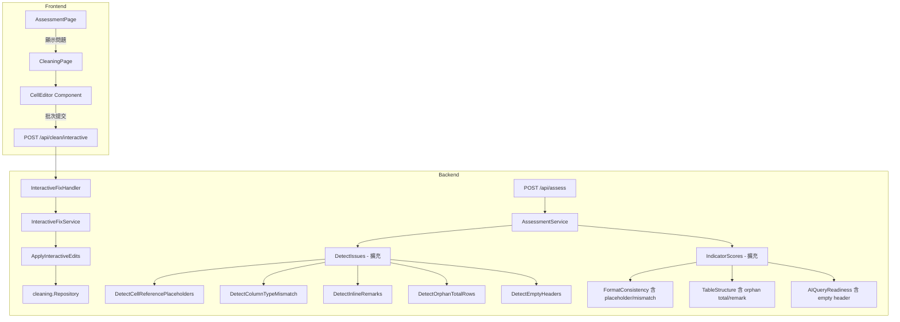

# Design Document: Data Quality Interactive Fix

## Overview

本設計擴充 SAFE-AI Excel 梳理小工具的 Assessment Engine 與 Cleaning Engine，新增 5 種語意層級的資料品質問題偵測（儲存格引用佔位符、欄位型別不一致、行內備註、孤立合計列、空白標題欄），並提供互動式儲存格編輯介面（Cell Editor），讓使用者可逐筆檢視問題儲存格並選擇修正方式。

**設計目標：**
- 在現有 `DetectIssues()` 流程中無縫加入新偵測邏輯
- 提供新的 `POST /api/clean/interactive` 端點處理使用者逐筆修正
- 前端新增 `CellEditor` 元件，嵌入現有 CleaningPage 流程中
- 新問題類型正確反映到 AI Readiness Score 計算中

## Architecture



**架構決策：**

1. **偵測邏輯放在 `issues.go`**：新增 5 個獨立的偵測函式（`detectCellReferencePlaceholders`, `detectColumnTypeMismatch` 等），由現有 `DetectIssues()` 統一呼叫。遵循現有模式，每個偵測函式接收 `*upload.SheetData` 並回傳 `[]Issue`。

2. **互動式修正作為獨立 Service 方法**：在 `cleaning.Service` 中新增 `ApplyInteractiveEdits()` 方法，與現有 `ApplyRules()` 平行。兩者共用相同的 `LogEntry` 機制以確保操作追蹤一致性。

3. **Cell Editor 為 CleaningPage 的子元件**：嵌入在 Step 5 頁面中，位於批次規則之後。偵測到互動式修正問題時顯示，使用者可在執行批次規則前或後進行互動修正。

4. **Score 影響整合在 `indicators.go` 中**：修改現有的 `CalculateFormatConsistency`、`CalculateTableStructure`、`CalculateAIQueryReadiness` 函式，接受新偵測結果作為額外輸入。

## Components and Interfaces

### Backend - Assessment 擴充

```go
// issues.go - 新增偵測函式

// DetectCellReferencePlaceholders 偵測「同XX數字」格式的儲存格
// Pattern: ^同[A-Z]+\d+$
func DetectCellReferencePlaceholders(data *upload.SheetData) []Issue

// DetectColumnTypeMismatch 偵測數值欄位中的非數值儲存格
// Threshold: >70% numeric → column is "numeric" type
func DetectColumnTypeMismatch(data *upload.SheetData) []Issue

// DetectInlineRemarks 偵測結構欄位中的括號備註
// Structured column: >60% match alphanumeric identifier pattern
// Flagged: parenthesized content with Chinese chars or length > 5
func DetectInlineRemarks(data *upload.SheetData) []Issue

// DetectOrphanTotalRows 偵測孤立合計列
// Conditions: after 2+ empty rows, ≤2 non-empty cells, at least one numeric
func DetectOrphanTotalRows(data *upload.SheetData) []Issue

// DetectEmptyHeaders 偵測空白標題欄
func DetectEmptyHeaders(data *upload.SheetData) []Issue
```

### Backend - Cleaning 擴充

```go
// model.go - 新增互動式修正相關結構

// InteractiveFixRequest 互動式修正 API 請求
type InteractiveFixRequest struct {
    AssessmentID uuid.UUID       `json:"assessment_id" binding:"required"`
    Edits        []CellEdit      `json:"edits" binding:"required,min=1"`
}

// CellEdit 單筆儲存格修正指令
type CellEdit struct {
    RowIndex int    `json:"row_index"`                        // 0-based data row index
    ColIndex int    `json:"col_index"`                        // 0-based column index
    Action   string `json:"action" binding:"required,oneof=replace keep delete_row remark_split header_rename"`
    Value    string `json:"value"`                            // required for "replace" and "header_rename"
}

// InteractiveFixResponse 互動式修正 API 回應
type InteractiveFixResponse struct {
    Success      bool       `json:"success"`
    RowsAffected int        `json:"rows_affected"`
    Warnings     []string   `json:"warnings"`
    LogEntries   []LogEntry `json:"log_entries"`
}
```

```go
// service.go - 新增互動式修正方法

// ApplyInteractiveEdits 執行使用者的互動式儲存格修正
// 操作順序：replace → remark_split → header_rename → delete_row (descending index)
func (s *Service) ApplyInteractiveEdits(ctx context.Context, userID uuid.UUID, req InteractiveFixRequest) (*InteractiveFixResponse, error)
```

```go
// handler.go - 新增端點處理

// ApplyInteractiveFix handles POST /api/clean/interactive
func (h *Handler) ApplyInteractiveFix(c *gin.Context)
```

### Backend - Indicator Score 擴充

```go
// indicators.go - 修改簽章以接受偵測結果

// CalculateFormatConsistencyWithIssues 計算格式一致性分數，納入 placeholder 和 type mismatch
// 每個 placeholder cell 視為 format mismatch
// 每個 type_mismatch cell 視為 format mismatch
func CalculateFormatConsistencyWithIssues(data *upload.SheetData, placeholderCells int, mismatchCells int) float64

// CalculateTableStructureWithIssues 計算表格結構分數，納入 orphan total 和 inline remark
// orphanTotalDetected: if true AND no keyword subtotals, apply -15
// inlineRemarkDense: if true (>20% in structured col) AND notes deduction not applied, apply -10
func CalculateTableStructureWithIssues(data *upload.SheetData, orphanTotalDetected bool, inlineRemarkDense bool) float64

// CalculateAIQueryReadinessWithIssues 計算 AI 查詢就緒度，納入 empty header
// emptyHeaderDetected: if true, fail "column name quality" sub-condition (-20)
func CalculateAIQueryReadinessWithIssues(data *upload.SheetData, emptyHeaderDetected bool) float64
```

### Frontend - CellEditor Component

```typescript
// components/CellEditor.tsx

interface FlaggedCell {
  row_index: number
  col_index: number
  column_name: string
  row_number: number       // 1-based Excel row
  current_value: string
  issue_type: string       // "cell_reference_placeholder" | "column_type_mismatch" | "inline_remark" | "empty_header"
  issue_description: string
}

interface CellEditAction {
  row_index: number
  col_index: number
  action: "replace" | "keep" | "delete_row" | "remark_split" | "header_rename"
  value?: string
}

interface CellEditorProps {
  assessmentId: string
  flaggedCells: FlaggedCell[]
  onComplete: (result: InteractiveFixResult) => void
}
```

### API 端點

| Method | Path | Request | Response |
|--------|------|---------|----------|
| POST | /api/clean/interactive | `InteractiveFixRequest` | `InteractiveFixResponse` |

## Data Models

### 新增 Issue Types

| Issue Type | Indicator | Severity | Detection Source |
|-----------|-----------|----------|-----------------|
| `cell_reference_placeholder` | `format_consistency` | High | `DetectCellReferencePlaceholders` |
| `column_type_mismatch` | `format_consistency` | High/Medium | `DetectColumnTypeMismatch` |
| `inline_remark` | `table_structure` | Medium | `DetectInlineRemarks` |
| `orphan_total_row` | `table_structure` | (sub-issue) | `DetectOrphanTotalRows` |
| `empty_header` | `ai_query_readiness` | Low | `DetectEmptyHeaders` |

### CellEdit Action 定義

| Action | 適用 Issue Types | 必須 value | 描述 |
|--------|-----------------|-----------|------|
| `replace` | all | ✓ | 將儲存格值替換為 value |
| `keep` | all | ✗ | 保留原值不變 |
| `delete_row` | all | ✗ | 刪除整列 |
| `remark_split` | `inline_remark` | ✗ | 分離括號備註到「備註」欄 |
| `header_rename` | `empty_header` | ✓ | 重新命名欄位標題 |

### 數值欄位識別規則

將 cell 值視為 numeric 的判定邏輯：
1. 去除前後空白
2. 移除貨幣符號（NT$, USD, $, ¥, €）
3. 移除千分位逗號
4. 嘗試 `strconv.ParseFloat`

### Remark Split 邏輯

```
Input:  "PI-20190227（IQC檢測CPU）"
Output: cell = "PI-20190227", 備註 column = "IQC檢測CPU"
```

括號匹配優先順序：全形 `（）` → 半形 `()`

### 操作順序保證

互動式修正批次處理嚴格按以下順序執行：
1. `replace` — 值替換（不影響索引）
2. `remark_split` — 備註分離（可能新增欄位，不影響行索引）
3. `header_rename` — 標題重命名（不影響資料索引）
4. `delete_row` — 列刪除（按索引降序處理，避免 index shifting）

## Correctness Properties

*A property is a characteristic or behavior that should hold true across all valid executions of a system—essentially, a formal statement about what the system should do. Properties serve as the bridge between human-readable specifications and machine-verifiable correctness guarantees.*

### Property 1: Cell Reference Placeholder Detection Completeness

*For any* SheetData containing cells, the `DetectCellReferencePlaceholders` function SHALL flag a cell if and only if its trimmed value matches the regex `^同[A-Z]+\d+$`. No cell matching the pattern shall be missed, and no cell not matching shall be falsely flagged.

**Validates: Requirements 1.1, 1.4**

### Property 2: Column Type Inference and Mismatch Flagging

*For any* column in a SheetData, if more than 70% of non-empty cells are numeric (after currency/comma removal), then all non-empty non-numeric cells in that column SHALL be flagged as `column_type_mismatch`, and if 70% or fewer are numeric, then no cells in that column SHALL be flagged. Empty cells SHALL never be flagged.

**Validates: Requirements 2.1, 2.2, 2.4, 2.5**

### Property 3: Column Type Mismatch Severity Threshold

*For any* numeric column with detected mismatches, if the mismatch count exceeds 10% of non-empty cells in that column, the severity SHALL be "High"; otherwise, severity SHALL be "Medium".

**Validates: Requirements 2.3**

### Property 4: Inline Remark Detection Precision

*For any* cell in a structured column (where >60% of non-empty cells match an alphanumeric identifier pattern), the cell SHALL be flagged as `inline_remark` if and only if it contains parenthesized content (half-width or full-width brackets) where the inner text contains Chinese characters OR has length > 5. Content matching structural patterns (single character codes, version numbers like "v2") SHALL NOT be flagged.

**Validates: Requirements 3.1, 3.2, 3.4, 3.5**

### Property 5: Orphan Total Row Detection

*For any* SheetData, a row SHALL be identified as an Orphan_Total_Row if and only if: (a) it appears after 2 or more consecutive empty rows following the main data block, (b) it contains at most 2 non-empty cells, and (c) at least one non-empty cell is numeric (parseable after removing thousands separators).

**Validates: Requirements 4.1, 4.4**

### Property 6: Empty Header Detection

*For any* SheetData, a column SHALL be flagged as `empty_header` if and only if its header value is null, empty string, or contains only whitespace characters after trimming.

**Validates: Requirements 5.1, 5.4**

### Property 7: Interactive Edit Application Order Invariant

*For any* batch of interactive edits containing a mix of replace, remark_split, header_rename, and delete_row actions, the Cleaning Engine SHALL apply them in strict order: all replacements first, then all remark splits, then all header renames, then all row deletions (with deletion indices processed in descending order). The final state SHALL be equivalent to applying them in this canonical order regardless of the input order.

**Validates: Requirements 7.1**

### Property 8: Cell Replacement Round-Trip

*For any* valid (row_index, col_index) pair within the data bounds and any non-empty replacement value, applying a "replace" edit SHALL result in the cell at that position containing exactly the replacement value, and the cleaning log SHALL contain an entry with operation_type "cell_edit" referencing the correct row index and both old and new values.

**Validates: Requirements 7.2**

### Property 9: Remark Split Preservation

*For any* cell containing parenthesized content (Chinese chars or length > 5) in a structured column, applying "remark_split" SHALL produce: (a) the original cell contains only the structural value (content before the parenthesized portion, trimmed), (b) a "備註" column contains exactly the extracted inner parenthesized text, and (c) concatenating the structural value + bracket + remark + bracket reconstitutes the original content.

**Validates: Requirements 7.3**

### Property 10: Row Deletion Index Safety

*For any* batch of delete_row operations with valid row indices, processing deletions in descending index order SHALL result in exactly those rows being removed without affecting the content of remaining rows. The row count after deletion SHALL equal the original count minus the number of distinct valid deletion indices.

**Validates: Requirements 7.5**

### Property 11: Invalid Edit Graceful Handling

*For any* batch of edits where some reference out-of-bounds row or column indices, those invalid edits SHALL be skipped (not applied), all valid edits in the same batch SHALL still be applied correctly, and the response SHALL contain warnings listing each skipped edit.

**Validates: Requirements 7.6**

### Property 12: Placeholder Cells Reduce Format Consistency Score

*For any* SheetData containing cell_reference_placeholder cells in a numeric column, the Format Consistency score SHALL be lower than if those cells contained valid numeric values. Specifically, each placeholder cell SHALL be counted as a format mismatch in its column's consistency calculation.

**Validates: Requirements 9.1**

### Property 13: Empty Header Reduces AI Query Readiness

*For any* SheetData where at least one column header is empty/whitespace, the AI Query Readiness score SHALL be exactly 20 points lower than it would be if all headers were valid (non-empty, non-duplicate, length > 1).

**Validates: Requirements 9.4**

### Property 14: Orphan Total Deduction Non-Duplication

*For any* SheetData where Orphan_Total_Rows are detected AND keyword-based subtotal rows are also detected, the Table Structure score SHALL NOT apply the -15 orphan total deduction (to avoid double-counting with the existing -15 subtotal deduction).

**Validates: Requirements 9.3**

## Error Handling

### Backend Error Cases

| 場景 | HTTP Status | Error Code | 處理方式 |
|------|-------------|------------|---------|
| assessment_id 不存在 | 404 | NOT_FOUND | 回傳「評估記錄不存在」 |
| edits 陣列為空 | 400 | VALIDATION_ERROR | 回傳「請提供至少一筆修正」 |
| 請求格式錯誤 (JSON parse fail) | 400 | VALIDATION_ERROR | 回傳 gin binding error |
| action 值不合法 | 400 | VALIDATION_ERROR | 回傳「無效的操作類型」 |
| replace/header_rename 缺少 value | 400 | VALIDATION_ERROR | 回傳「該操作需要提供新值」 |
| row_index/col_index 超出範圍 | 200 (partial) | — | 跳過該筆，加入 warnings |
| 資料載入失敗 | 500 | PROCESSING_ERROR | 回傳「無法載入工作表資料」 |
| 儲存失敗 | 500 | PROCESSING_ERROR | 回傳「無法儲存修正結果」 |

### Frontend Error Handling

- 網路錯誤：顯示重試提示
- 400 錯誤：顯示驗證錯誤訊息給使用者
- 404 錯誤：提示使用者重新執行評估
- 部分失敗（warnings）：顯示成功訊息 + warnings 列表

## Testing Strategy

### Property-Based Testing (PBT)

本功能包含大量純函式邏輯（偵測演算法、修正操作），非常適合 property-based testing。

**PBT 函式庫**：Go 語言使用 [`pgregory.net/rapid`](https://github.com/flyingmutant/rapid)（已在專案中使用）

**配置**：
- 每個 property test 最少 100 次迭代
- 使用 `rapid.Check(t, func(t *rapid.T) { ... })` 模式
- 每個測試標記對應的 design property

**Tag 格式**：
```go
// Feature: data-quality-interactive-fix, Property 1: Cell Reference Placeholder Detection Completeness
```

**PBT 測試清單：**

| Property | 測試目標 | Generator 策略 |
|----------|---------|---------------|
| P1 | 佔位符 regex 偵測 | 生成隨機字串（含/不含匹配模式） |
| P2 | 欄位型別推斷+標記 | 生成欄位（numeric ratio 0-100%）|
| P3 | 嚴重度閾值 | 生成 numeric 欄位（mismatch ratio 圍繞 10%）|
| P4 | 行內備註偵測 | 生成結構欄位 cell（含各種括號內容）|
| P5 | 孤立合計列偵測 | 生成尾部資料（empty gap + sparse rows）|
| P6 | 空白標題偵測 | 生成 header array（含空白/whitespace）|
| P7 | 修正操作順序 | 生成混合 edit batch，驗證最終狀態 |
| P8 | 值替換正確性 | 生成 (row, col, value) tuple |
| P9 | 備註分離正確性 | 生成含括號的 cell 值 |
| P10 | 刪除索引安全性 | 生成多筆 delete 指令 |
| P11 | 無效索引處理 | 生成含 out-of-bounds 的 edit batch |
| P12 | Placeholder 影響分數 | 生成 numeric 欄位含 placeholder |
| P13 | Empty header 影響分數 | 生成含空白 header 的 SheetData |
| P14 | Orphan total 不重複扣分 | 生成含/不含 keyword subtotal 的資料 |

### Unit Tests (Example-Based)

| 測試目標 | 場景 |
|---------|------|
| Issue 輸出格式 | 各偵測函式回傳正確的 Title、Severity、Examples 結構 |
| API 驗證 | 空 edits → 400、無效 action → 400、缺少 value → 400 |
| API 404 | 不存在的 assessment_id |
| Cell Editor 渲染 | 各 issue type 顯示正確的 action 選項 |
| remark_split 特殊 action | 僅 inline_remark 顯示「分離備註」 |
| header_rename UI | empty_header 顯示 inline text input |

### Integration Tests

| 測試目標 | 驗證內容 |
|---------|---------|
| 完整互動修正流程 | assess → detect issues → submit edits → verify data + log |
| 分數更新 | 修正後重新評估，驗證分數提升 |
| 與批次規則並存 | 先批次清理再互動修正，兩者 log 合併 |
