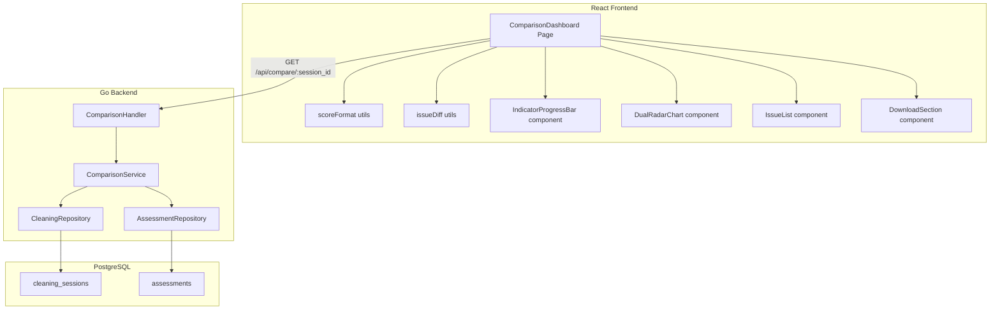

# Design Document: Export Comparison Dashboard

## Overview

The Export Comparison Dashboard redesigns the existing ExportPage into a visual comparison view that displays before/after quality metrics from the data cleaning process. It joins data from the `Assessment` and `CleaningSession` models to present a unified dashboard showing total score improvement, per-indicator progress bars with improvement segments, a dual-layer radar chart, resolved/remaining issues, and download functionality.

The implementation consists of:
- A new backend API endpoint (`GET /api/compare/:session_id`) that joins cleaning session + both assessments into a single response
- A redesigned React frontend component replacing ExportPage with the comparison dashboard
- Pure utility functions for score formatting, delta computation, and issue diffing

## Architecture



## Components and Interfaces

### Backend Components

#### ComparisonHandler (`internal/comparison/handler.go`)

Handles the HTTP endpoint for the comparison API.

```go
// Handler handles comparison API HTTP requests
type Handler struct {
    service *Service
}

// GetComparison handles GET /api/compare/:session_id
func (h *Handler) GetComparison(c *gin.Context)
```

#### ComparisonService (`internal/comparison/service.go`)

Orchestrates data retrieval by joining cleaning session with both assessments.

```go
// Service handles comparison business logic
type Service struct {
    cleanRepo  *cleaning.Repository
    assessRepo *assessment.Repository
}

// GetComparison retrieves the full comparison data for a cleaning session
func (s *Service) GetComparison(ctx context.Context, sessionID, userID uuid.UUID) (*ComparisonResponse, error)
```

#### ComparisonResponse (`internal/comparison/model.go`)

```go
// ComparisonResponse is the API response containing full before/after comparison data
type ComparisonResponse struct {
    Session          SessionSummary     `json:"session"`
    OriginalAssess   AssessmentSummary  `json:"original_assessment"`
    PostCleanAssess  AssessmentSummary  `json:"post_clean_assessment"`
}

// SessionSummary contains cleaning session metadata
type SessionSummary struct {
    ID           uuid.UUID `json:"id"`
    RowsBefore   int       `json:"rows_before"`
    RowsAfter    int       `json:"rows_after"`
    ScoreBefore  float64   `json:"score_before"`
    ScoreAfter   float64   `json:"score_after"`
    RulesApplied []string  `json:"rules_applied"`
    CleaningLog  []cleaning.LogEntry `json:"cleaning_log"`
    CreatedAt    time.Time `json:"created_at"`
}

// AssessmentSummary contains the indicator scores and issues for one assessment
type AssessmentSummary struct {
    ID                 uuid.UUID              `json:"id"`
    TotalScore         float64                `json:"total_score"`
    Status             string                 `json:"status"`
    RowCompleteness    float64                `json:"row_completeness"`
    ColumnCompleteness float64                `json:"column_completeness"`
    FormatConsistency  float64                `json:"format_consistency"`
    DuplicateSimilar   float64                `json:"duplicate_similar"`
    TableStructure     float64                `json:"table_structure"`
    AIQueryReadiness   float64                `json:"ai_query_readiness"`
    Issues             []assessment.Issue     `json:"issues"`
    RowDistribution    assessment.RowDistribution `json:"row_distribution"`
}
```

### Frontend Components

#### ComparisonDashboard (`pages/ExportPage.tsx` — rewritten)

Main page component. Fetches data from `GET /api/compare/:session_id` and renders all sub-components.

```typescript
interface ComparisonData {
  session: {
    id: string
    rows_before: number
    rows_after: number
    score_before: number
    score_after: number
    rules_applied: string[]
    cleaning_log: LogEntry[]
  }
  original_assessment: AssessmentSummary
  post_clean_assessment: AssessmentSummary
}
```

#### IndicatorProgressBar (inline component)

Renders a single indicator's before/after comparison as a horizontal bar with two color segments.

```typescript
interface IndicatorProgressBarProps {
  label: string        // Traditional Chinese indicator name
  before: number       // 0-100 score before cleaning
  after: number        // 0-100 score after cleaning
}
```

**Rendering logic:**
- Base segment: width = `before%` of total bar, using `var(--accent)` color
- Improvement segment: width = `(after - before)%`, starting at `before%`, using lighter accent
- Text label: `"{before} → {after} (+{delta})"` where delta = after - before

#### DualRadarChart (inline component)

Uses recharts `RadarChart` with two `Radar` layers:

```typescript
interface DualRadarChartProps {
  before: IndicatorScores  // 6 scores from original assessment
  after: IndicatorScores   // 6 scores from post-cleaning assessment
}
```

**recharts structure:**
```tsx
<RadarChart>
  <PolarGrid />
  <PolarAngleAxis dataKey="name" />
  <PolarRadiusAxis domain={[0, 100]} />
  <Radar name="梳理前" dataKey="before" stroke="#94a3b8" fill="#94a3b8" fillOpacity={0.2} />
  <Radar name="梳理後" dataKey="after" stroke="var(--green)" fill="var(--green)" fillOpacity={0.3} />
  <Legend />
</RadarChart>
```

#### Score Formatting Utilities (`utils/scoreFormat.ts`)

Pure functions for formatting display strings:

```typescript
// Formats the improvement delta display: "28.8 (+55.6)"
export function formatScoreWithDelta(before: number, after: number): string

// Formats indicator progress bar label: "45.2 → 78.6 (+33.4)"
export function formatIndicatorLabel(before: number, after: number): string

// Determines delta color: green for positive, gray for zero
export function getDeltaColor(delta: number): string
```

#### Issue Diffing Utility (`utils/issueDiff.ts`)

Pure function for computing resolved vs remaining issues:

```typescript
interface Issue {
  title: string
  severity: string
  affected_rows: number
}

// Returns issues present in original but absent in postCleaning (by title match)
export function getResolvedIssues(original: Issue[], postCleaning: Issue[]): Issue[]

// Returns the post-cleaning issues (alias for clarity)
export function getRemainingIssues(postCleaning: Issue[]): Issue[]
```

## Data Models

### Database (No schema changes needed)

The comparison API uses existing tables:
- `assessments` — stores indicator scores, total_score, status, issues (JSONB)
- `cleaning_sessions` — stores assessment_id, rows_before/after, score_before/after, rules_applied, cleaning_log

The `cleaning_sessions.assessment_id` foreign key references the **original** assessment. To get the post-cleaning assessment, the service runs the assessment on the cleaned data file referenced by `refined_file_path`.

### Data Flow

1. Frontend calls `GET /api/compare/:session_id`
2. Backend loads `CleaningSession` by ID (with user ownership check)
3. Backend loads the original `Assessment` via `session.assessment_id`
4. Backend runs a fresh assessment on the refined file to get post-cleaning scores
5. Backend assembles `ComparisonResponse` and returns it
6. Frontend renders all dashboard sections from the single response

**Design Decision:** Running assessment on-demand vs. storing post-cleaning assessment separately.

*Rationale:* Running on-demand ensures the post-cleaning assessment always reflects current scoring logic (if weights change). The computation is fast (<100ms for typical files). This avoids schema changes and data duplication. The trade-off is slightly higher latency on page load, which is acceptable for this use case.

## Correctness Properties

*A property is a characteristic or behavior that should hold true across all valid executions of a system—essentially, a formal statement about what the system should do. Properties serve as the bridge between human-readable specifications and machine-verifiable correctness guarantees.*

### Property 1: Score display format correctness

*For any* pair of valid scores (before: 0–100, after: 0–100), `formatScoreWithDelta(before, after)` SHALL produce a string matching the pattern `"X.X (+Y.Y)"` where X.X equals `before` rounded to 1 decimal and Y.Y equals `(after - before)` rounded to 1 decimal.

**Validates: Requirements 2.1**

### Property 2: Indicator progress bar segment positioning

*For any* pair of indicator scores (before: 0–100, after: 0–100) where after >= before, the base segment width percentage SHALL equal `before` and the improvement segment width percentage SHALL equal `(after - before)`, such that base + improvement <= 100.

**Validates: Requirements 3.2, 3.3, 3.7**

### Property 3: Indicator label format correctness

*For any* pair of indicator scores (before: 0–100, after: 0–100), `formatIndicatorLabel(before, after)` SHALL produce a string matching the pattern `"X.X → Y.Y (+Z.Z)"` where X.X = before, Y.Y = after, and Z.Z = after - before, all rounded to 1 decimal.

**Validates: Requirements 3.5**

### Property 4: Resolved issues set difference

*For any* two lists of issues (original and postCleaning), `getResolvedIssues(original, postCleaning)` SHALL return exactly the issues whose titles appear in `original` but do not appear in `postCleaning`, preserving the original issue's metadata.

**Validates: Requirements 5.3**

### Property 5: Comparison API response completeness

*For any* valid CleaningSession with a linked Assessment, the comparison API response SHALL contain: both assessments' six indicator scores (row_completeness, column_completeness, format_consistency, duplicate_similar, table_structure, ai_query_readiness), both total_scores, both status grades, both issues lists, and session metadata (rows_before, rows_after, score_before, score_after, rules_applied, cleaning_log).

**Validates: Requirements 8.1, 8.2, 8.3**

### Property 6: User ownership authorization

*For any* CleaningSession belonging to user A, a request from user B (where B ≠ A) to the comparison API SHALL return HTTP 404 (session not found), preventing cross-user data access.

**Validates: Requirements 8.5**

## Error Handling

| Scenario | Backend Response | Frontend Behavior |
|----------|-----------------|-------------------|
| CleaningSession not found | HTTP 404 `{"error": {"code": "NOT_FOUND", "message": "梳理記錄不存在"}}` | Display error card with link to cleaning step |
| User doesn't own session | HTTP 404 (same as not found) | Display error card |
| Assessment data missing | HTTP 500 `{"error": {"code": "INTERNAL_ERROR", "message": "..."}}` | Display generic error with retry option |
| Assessment computation fails | HTTP 500 | Display generic error |
| Download fails | Existing export endpoint errors | Show toast notification, keep dashboard functional |
| Network timeout | Axios timeout | Show retry button in loading skeleton |

**Design Decision:** Return 404 (not 403) for ownership failures to prevent user enumeration attacks.

## Testing Strategy

### Unit Tests (Example-based)

**Frontend:**
- ComparisonDashboard renders loading skeleton while fetching
- ComparisonDashboard renders error state when session unavailable
- DualRadarChart renders two Radar layers with correct colors
- IndicatorProgressBar renders zero-delta case (no improvement segment)
- Download buttons disable during download and show loading
- Issue list shows correct empty-state messages

**Backend:**
- ComparisonService returns 404 for non-existent session
- ComparisonService returns 404 for wrong user's session
- ComparisonHandler returns proper error format for invalid UUID param

### Property-Based Tests

**Library:** Go — `pgregory.net/rapid`; TypeScript — `fast-check`

**Configuration:** Minimum 100 iterations per property test.

Each property test references its design property:

- **Feature: export-comparison-dashboard, Property 1: Score display format correctness** — TypeScript fast-check test generating random (before, after) score pairs, verifying formatted output.
- **Feature: export-comparison-dashboard, Property 2: Indicator progress bar segment positioning** — TypeScript fast-check test generating random indicator score pairs, verifying segment widths sum correctly.
- **Feature: export-comparison-dashboard, Property 3: Indicator label format correctness** — TypeScript fast-check test generating random score pairs, verifying label format.
- **Feature: export-comparison-dashboard, Property 4: Resolved issues set difference** — TypeScript fast-check test generating random issue lists, verifying set difference computation.
- **Feature: export-comparison-dashboard, Property 5: Comparison API response completeness** — Go rapid test generating random CleaningSession + Assessment data, verifying response schema.
- **Feature: export-comparison-dashboard, Property 6: User ownership authorization** — Go rapid test generating random sessions with mismatched user IDs, verifying 404 response.

### Integration Tests

- Full API flow: create assessment → apply cleaning → GET /api/compare/:session_id → verify complete response
- Download endpoint integration through dashboard UI
