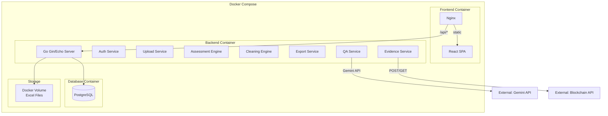
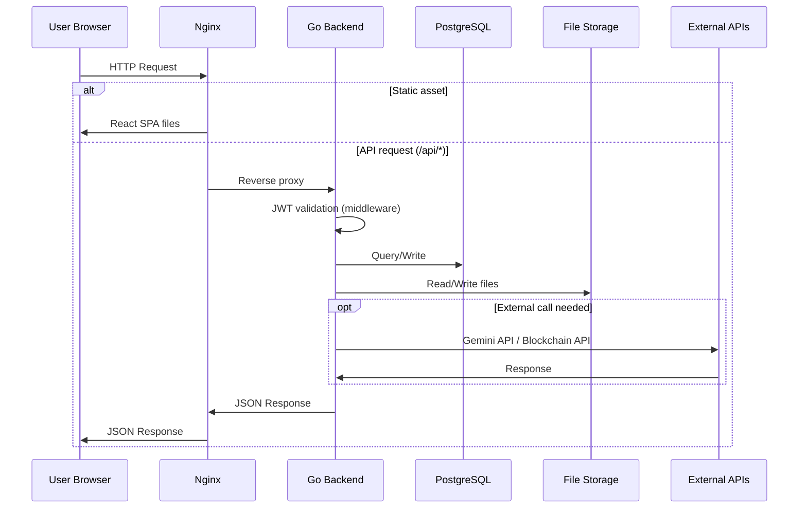
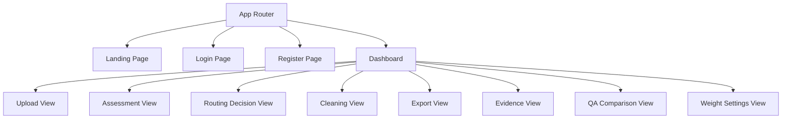

# Design Document: SAFE-AI Excel 梳理小工具

## Overview

SAFE-AI Excel 梳理小工具是一個 Docker-based、前後端分離的 MVP 資料品質評估與梳理平台。系統架構採用 React + TypeScript 前端（由 Nginx 伺服器提供靜態檔案與反向代理）、Go (Gin/Echo) 後端 RESTful API、以及 PostgreSQL 資料庫。

核心價值流程：**上傳 → 評估 → 分流 → 梳理 → 產出 → 存證 → 問答對比**

系統設計遵循以下原則：
- **模組化**：各功能模組（Auth、Upload、Assessment、Cleaning、Export、Evidence、QA）獨立設計，可分別替換或擴展
- **Deterministic 評估**：六項 AI Data Readiness 指標全為 rule-based 公式計算，確保可重現性
- **最小 AI 使用**：僅模組 F（問答對比）串接 Gemini API，其餘均為 deterministic 邏輯
- **繁體中文**：所有使用者介面與 API 訊息均為繁體中文

## Architecture

### High-Level Architecture



### Request Flow



### Layer Architecture (Backend)

```
┌─────────────────────────────────────────────────────┐
│  Router Layer (Gin/Echo)                            │
│  - Route definitions                                │
│  - Middleware (JWT, CORS, Rate Limit, Recovery)     │
├─────────────────────────────────────────────────────┤
│  Handler Layer                                      │
│  - Request validation & binding                     │
│  - Response formatting                              │
├─────────────────────────────────────────────────────┤
│  Service Layer                                      │
│  - Business logic                                   │
│  - Assessment algorithms                            │
│  - Cleaning rules                                   │
├─────────────────────────────────────────────────────┤
│  Repository Layer                                   │
│  - Database queries (PostgreSQL)                    │
│  - File I/O operations                              │
│  - External API clients                             │
└─────────────────────────────────────────────────────┘
```

## Components and Interfaces

### Backend Service Modules

#### 1. Auth Service (`/internal/auth/`)

| Responsibility | Detail |
|---|---|
| Registration | Email + password validation → bcrypt hash → store |
| Login | Credential verification → JWT issuance |
| Logout | Token invalidation (blacklist or short-lived + refresh pattern) |
| Rate Limiting | Per-email login attempt tracking (5 attempts / 15 min) |

**Interface:**
```go
type AuthService interface {
    Register(ctx context.Context, req RegisterRequest) (*User, error)
    Login(ctx context.Context, req LoginRequest) (*TokenResponse, error)
    Logout(ctx context.Context, tokenID string) error
    GetCurrentUser(ctx context.Context, userID uuid.UUID) (*User, error)
    CheckRateLimit(ctx context.Context, email string) (bool, error)
}
```

#### 2. Upload Service (`/internal/upload/`)

| Responsibility | Detail |
|---|---|
| File validation | Format (xlsx/csv), size (≤50MB), row count (≤100,000) |
| File storage | Persist to Docker volume with UUID-based path |
| Metadata extraction | Sheet names, row/col counts, merged cells, formula values |
| Encoding support | UTF-8, UTF-8 with BOM for CSV |

**Interface:**
```go
type UploadService interface {
    Upload(ctx context.Context, userID uuid.UUID, file io.Reader, filename string) (*Upload, error)
    GetSheets(ctx context.Context, uploadID uuid.UUID) ([]string, error)
    SelectSheet(ctx context.Context, uploadID uuid.UUID, sheetName string) error
    GetUpload(ctx context.Context, uploadID uuid.UUID) (*Upload, error)
}
```

#### 3. Assessment Engine (`/internal/assessment/`)

| Responsibility | Detail |
|---|---|
| Indicator calculation | 6 deterministic indicators |
| Score aggregation | Weighted sum → total score |
| Grading | Ready / Conditionally Ready / Not Ready |
| Issue detection | Problem list with severity + affected rows + recommendations |

**Interface:**
```go
type AssessmentEngine interface {
    RunAssessment(ctx context.Context, uploadID uuid.UUID, sheetName string) (*Assessment, error)
    GetAssessment(ctx context.Context, assessmentID uuid.UUID) (*Assessment, error)
    GetIssues(ctx context.Context, assessmentID uuid.UUID) ([]Issue, error)
}

type IndicatorCalculator interface {
    CalculateRowCompleteness(data *SheetData) float64
    CalculateColumnCompleteness(data *SheetData) float64
    CalculateFormatConsistency(data *SheetData) float64
    CalculateDuplicateSimilar(data *SheetData) float64
    CalculateTableStructure(data *SheetData) float64
    CalculateAIQueryReadiness(data *SheetData) float64
}
```

#### 4. Cleaning Engine (`/internal/cleaning/`)

| Responsibility | Detail |
|---|---|
| Batch rules | 4 rules: date normalization, dedup, name normalization, subtotal removal |
| Row operations | Fill N/A, delete row |
| Logging | Every operation → Cleaning_Log entry |
| Preview | Show results before committing |

**Interface:**
```go
type CleaningEngine interface {
    ApplyRules(ctx context.Context, req CleanRequest) (*CleaningSession, error)
    Preview(ctx context.Context, sessionID uuid.UUID) (*PreviewResult, error)
    GetLog(ctx context.Context, sessionID uuid.UUID) ([]LogEntry, error)
}
```

#### 5. Export Service (`/internal/export/`)

| Responsibility | Detail |
|---|---|
| Excel generation | refined.xlsx from cleaned data |
| PDF generation | Branded report with charts |
| Log packaging | cleaning.log JSON file |

**Interface:**
```go
type ExportService interface {
    GenerateExcel(ctx context.Context, sessionID uuid.UUID) (io.Reader, error)
    GeneratePDF(ctx context.Context, sessionID uuid.UUID) (io.Reader, error)
    GenerateLog(ctx context.Context, sessionID uuid.UUID) (io.Reader, error)
}
```

#### 6. Evidence Service (`/internal/evidence/`)

| Responsibility | Detail |
|---|---|
| Hash computation | SHA-256 of refined.xlsx, cleaning.log, report.pdf |
| Blockchain proxy | Forward to external blockchain API |
| Status tracking | Store record_id and signature_status |

**Interface:**
```go
type EvidenceService interface {
    Submit(ctx context.Context, sessionID uuid.UUID) (*EvidenceRecord, error)
    GetRecord(ctx context.Context, recordID string) (*EvidenceRecord, error)
}
```

#### 7. QA Service (`/internal/qa/`)

| Responsibility | Detail |
|---|---|
| Data insufficiency check | Column missing rate > 50% → block |
| Gemini integration | Send structured CSV + question → get response |
| Suggestion generation | 3 suggested questions from column names |
| Consent enforcement | Block if user hasn't consented |

**Interface:**
```go
type QAService interface {
    Ask(ctx context.Context, req QARequest) (*QAResponse, error)
    GetSuggestions(ctx context.Context, assessmentID uuid.UUID) ([]string, error)
}
```

### Frontend Components



### Key Frontend Libraries

| Purpose | Library |
|---|---|
| UI Framework | React 18+ with TypeScript |
| Routing | React Router v6 |
| HTTP Client | Axios |
| State Management | React Context + useReducer (MVP scope) |
| Charts | Recharts (ring charts, bar charts) |
| Table | TanStack Table (data grid with sorting/filtering) |
| Slider | rc-slider or similar for weight controls |
| PDF Viewer | N/A (download only) |
| i18n | Static Traditional Chinese (no i18n library needed for v0.1) |

## Data Models

### Database Schema

```mermaid
erDiagram
    users ||--o{ uploads : "has"
    users ||--o{ cleaning_sessions : "performs"
    uploads ||--o{ assessments : "evaluated_by"
    assessments ||--o{ cleaning_sessions : "cleaned_via"
    cleaning_sessions ||--o| evidence_records : "evidenced_by"
    
    users {
        uuid id PK
        varchar email "UNIQUE, NOT NULL"
        varchar password_hash "bcrypt, NOT NULL"
        timestamp created_at "DEFAULT NOW()"
        timestamp updated_at
    }
    
    uploads {
        uuid id PK
        uuid user_id FK
        varchar filename "original filename"
        varchar file_path "storage path"
        bigint file_size "bytes"
        int row_count
        int col_count
        varchar selected_sheet "nullable"
        jsonb sheet_names "array of sheet names"
        jsonb merged_cells "array of cell ranges"
        timestamp created_at
    }
    
    assessments {
        uuid id PK
        uuid upload_id FK
        float total_score "0-100, 1 decimal"
        float row_completeness "0-100"
        float column_completeness "0-100"
        float format_consistency "0-100"
        float duplicate_similar "0-100"
        float table_structure "0-100"
        float ai_query_readiness "0-100"
        jsonb weights_snapshot "weights at assessment time"
        varchar status "ready|conditional|not_ready"
        jsonb issues "problem list"
        jsonb column_details "per-column metrics"
        timestamp created_at
    }
    
    cleaning_sessions {
        uuid id PK
        uuid assessment_id FK
        uuid user_id FK
        jsonb rules_applied "applied rule configs"
        int rows_before
        int rows_after
        float score_before
        float score_after "re-assessment score"
        jsonb cleaning_log "complete operation log"
        varchar refined_file_path "path to refined file"
        timestamp created_at
    }
    
    evidence_records {
        uuid id PK
        uuid cleaning_session_id FK
        varchar dataset_hash "SHA-256"
        varchar log_hash "SHA-256"
        varchar report_hash "SHA-256"
        varchar record_id "blockchain record ID"
        varchar transaction_hash "nullable"
        varchar signature_status "confirmed|pending|demo"
        varchar verification_url "nullable"
        timestamp created_at
    }
    
    system_settings {
        varchar key PK
        jsonb value "setting value"
        timestamp updated_at
        uuid updated_by FK
    }
    
    login_attempts {
        uuid id PK
        varchar email "NOT NULL"
        boolean success
        timestamp attempted_at
    }
}
```

### Key Data Structures (Go)

```go
// SheetData represents parsed spreadsheet data for assessment
type SheetData struct {
    Headers     []string       // column names
    Rows        [][]CellValue  // data rows (excluding header)
    MergedCells []MergedRange  // detected merged cell ranges
    RowCount    int
    ColCount    int
}

type CellValue struct {
    Raw       string  // original string value
    IsEmpty   bool    // null, whitespace-only, or no value
    Numeric   *float64 // parsed numeric value if applicable
    Date      *time.Time // parsed date if applicable
}

type MergedRange struct {
    StartRow int
    EndRow   int
    StartCol int
    EndCol   int
}

// Assessment result
type Assessment struct {
    ID                 uuid.UUID
    UploadID           uuid.UUID
    TotalScore         float64
    RowCompleteness    float64
    ColumnCompleteness float64
    FormatConsistency  float64
    DuplicateSimilar   float64
    TableStructure     float64
    AIQueryReadiness   float64
    WeightsSnapshot    Weights
    Status             string // "ready", "conditional", "not_ready"
    Issues             []Issue
    ColumnDetails      []ColumnDetail
    CreatedAt          time.Time
}

type Weights struct {
    RowCompleteness    float64 `json:"row_completeness"`    // default 0.20
    ColumnCompleteness float64 `json:"column_completeness"` // default 0.20
    FormatConsistency  float64 `json:"format_consistency"`  // default 0.15
    DuplicateSimilar   float64 `json:"duplicate_similar"`   // default 0.10
    TableStructure     float64 `json:"table_structure"`     // default 0.15
    AIQueryReadiness   float64 `json:"ai_query_readiness"`  // default 0.20
}

type Issue struct {
    Severity    string // "High", "Medium", "Low"
    AffectedRows int
    Description string // Traditional Chinese
    Indicator   string // which indicator detected this
}

// Cleaning log entry
type LogEntry struct {
    OperationType string    `json:"operation_type"`
    AffectedRows  []int     `json:"affected_rows"`
    Timestamp     time.Time `json:"timestamp"`
    OperatorID    uuid.UUID `json:"operator_id"`
    Details       string    `json:"details"`
}

// Evidence submission payload
type EvidenceSubmitRequest struct {
    DatasetHash    string            `json:"dataset_hash"`
    CleaningLogHash string           `json:"cleaning_log_hash"`
    ReportHash     string            `json:"report_hash"`
    Timestamp      time.Time         `json:"timestamp"`
    ToolVersion    string            `json:"tool_version"`
    RuleVersion    string            `json:"rule_version"`
    OperatorID     string            `json:"operator_id"`
    Metadata       EvidenceMetadata  `json:"metadata"`
}

type EvidenceMetadata struct {
    OriginalFilename string  `json:"original_filename"`
    OriginalRows     int     `json:"original_rows"`
    RefinedRows      int     `json:"refined_rows"`
    ReadinessBefore  float64 `json:"readiness_before"`
    ReadinessAfter   float64 `json:"readiness_after"`
}
```

### API Design

#### Authentication Endpoints

| Method | Endpoint | Request | Response |
|--------|----------|---------|----------|
| POST | `/api/auth/register` | `{email, password}` | `{id, email, created_at}` |
| POST | `/api/auth/login` | `{email, password}` | `{token, expires_at}` |
| POST | `/api/auth/logout` | (JWT in header) | `{message}` |
| GET | `/api/auth/me` | (JWT in header) | `{id, email, created_at}` |

#### Upload Endpoints

| Method | Endpoint | Request | Response |
|--------|----------|---------|----------|
| POST | `/api/upload` | multipart/form-data | `{id, filename, sheets, row_count, ...}` |
| GET | `/api/upload/{id}/sheets` | — | `{sheets: [...]}` |

#### Assessment Endpoints

| Method | Endpoint | Request | Response |
|--------|----------|---------|----------|
| POST | `/api/assess` | `{upload_id, sheet_name}` | `{assessment_id, status: "processing"}` |
| GET | `/api/assess/{id}` | — | Full assessment result |
| GET | `/api/assess/{id}/issues` | — | `{issues: [...]}` |

#### Cleaning Endpoints

| Method | Endpoint | Request | Response |
|--------|----------|---------|----------|
| POST | `/api/clean/apply` | `{assessment_id, rules: [...], row_ops: [...]}` | `{session_id, rows_before, rows_after}` |
| GET | `/api/clean/{id}/preview` | — | Preview of cleaned data |
| GET | `/api/clean/{id}/log` | — | Cleaning log entries |

#### Export Endpoints

| Method | Endpoint | Response |
|--------|----------|----------|
| GET | `/api/export/{id}/xlsx` | File download (application/vnd.openxmlformats) |
| GET | `/api/export/{id}/pdf` | File download (application/pdf) |
| GET | `/api/export/{id}/log` | File download (application/json) |

#### Evidence Endpoints

| Method | Endpoint | Request | Response |
|--------|----------|---------|----------|
| POST | `/api/evidence/submit` | `{session_id}` | `{record_id, signature_status, ...}` |
| GET | `/api/evidence/{record_id}` | — | Evidence record details |

#### QA Endpoints

| Method | Endpoint | Request | Response |
|--------|----------|---------|----------|
| POST | `/api/qa/ask` | `{session_id, question, consent: true}` | `{original_answer, cleaned_answer}` |
| GET | `/api/qa/suggestions/{assess_id}` | — | `{suggestions: [q1, q2, q3]}` |

#### Settings Endpoints

| Method | Endpoint | Request | Response |
|--------|----------|---------|----------|
| GET | `/api/settings/weights` | — | Current weights |
| PUT | `/api/settings/weights` | `{weights}` | Updated weights |

#### Standard Error Response Format

```json
{
  "error": {
    "code": "VALIDATION_ERROR",
    "message": "密碼長度需介於 8 至 72 字元之間",
    "details": {}
  }
}
```

### Key Algorithms

#### Assessment Indicator Algorithms

##### 1. Row Completeness

```
Input: SheetData (headers excluded)
Output: float64 (0-100)

Algorithm:
  if len(rows) == 0:
    return 0
  
  totalRatio = 0
  for each row in rows:
    nonEmpty = count cells where !cell.IsEmpty
    totalRatio += nonEmpty / colCount
  
  return (totalRatio / len(rows)) * 100
```

##### 2. Column Completeness

```
Input: SheetData
Output: float64 (0-100), []ColumnDetail

Algorithm:
  if len(rows) == 0:
    return 0
  
  totalRatio = 0
  for each col in 0..colCount-1:
    nonEmpty = count rows where !rows[row][col].IsEmpty
    colRatio = nonEmpty / len(rows)
    totalRatio += colRatio
    record colRatio in ColumnDetail
  
  return (totalRatio / colCount) * 100
```

##### 3. Format Consistency

```
Input: SheetData
Output: float64 (0-100)

Algorithm:
  validCols = 0
  totalScore = 0
  
  for each col in 0..colCount-1:
    nonEmptyValues = filter rows[*][col] where !IsEmpty
    if len(nonEmptyValues) == 0:
      skip (excluded from average)
      continue
    
    validCols++
    formatCounts = map[FormatType]int{}
    
    for each value in nonEmptyValues:
      type = detectFormatType(value)  // priority: date > numeric > boolean > text
      formatCounts[type]++
    
    dominantCount = max(formatCounts)  // tie-break: highest priority
    colScore = dominantCount / len(nonEmptyValues)
    totalScore += colScore
  
  if validCols == 0:
    return 100  // no data to evaluate
  
  return (totalScore / validCols) * 100
```

**Format Type Detection (priority order):**
1. **Date**: matches `yyyy/MM/dd`, `yyyy-MM-dd`, ROC `yyy.M.d`
2. **Numeric**: integer, thousands-separated (`1,234`), decimal (`1.5`)
3. **Boolean**: `true/false`, `是/否`, `Y/N` (case-insensitive)
4. **Text**: everything else

##### 4. Duplicate / Similar

```
Input: SheetData
Output: float64 (0-100)

Algorithm:
  if len(rows) == 0:
    return 100
  
  // Step 1: Exact duplicates via full-row hash
  rowHashes = map[string]int{}  // hash → count
  for each row in rows:
    h = sha256(concatenate all cell values with separator)
    rowHashes[h]++
  
  exactDuplicateCount = sum(count - 1 for count in rowHashes where count > 1)
  
  // Step 2: Near-duplicate detection
  eligibleCols = selectEligibleColumns(data)
  // criteria: text type, 5% < cardinality < 80%, max 5 cols (left-to-right)
  
  nearDuplicateGroups = 0
  for each col in eligibleCols:
    uniqueValues = distinct non-empty values in col
    for each pair (v1, v2) in uniqueValues:
      if levenshteinDistance(v1, v2) <= 2:
        nearDuplicateGroups++
  
  // Step 3: Score
  penalty = (exactDuplicateCount + nearDuplicateGroups * 0.5) / len(rows)
  score = max(0, (1 - penalty) * 100)
  
  return score
```

##### 5. Table Structure Quality

```
Input: SheetData, MergedCells
Output: float64 (0-100)

Algorithm:
  score = 100
  
  // Check merged cells
  if len(mergedCells) > 0:
    score -= 20
  
  // Check multi-layer headers (first 5 rows)
  textOnlyRows = 0
  for row in rows[0:min(5, len(rows))]:
    if allNonEmptyCellsAreText(row) AND noRepeatedValues(row):
      textOnlyRows++
  if textOnlyRows > 1:
    score -= 20
  
  // Check subtotal rows
  for each row in rows:
    if anyCellContains(row, ["小計", "合計", "total", "subtotal"]):
      score -= 15
      break  // deduction applied once
  
  // Check multiple tables (2+ consecutive empty rows)
  if hasConsecutiveEmptyRows(rows, threshold=2):
    score -= 25
  
  // Check notes in data columns
  for each textCol in textColumns:
    lengths = textLengths(textCol)
    if stddev(lengths) > mean(lengths) * 3 AND mean(lengths) > 0:
      score -= 10
      break  // deduction applied once
  
  return max(0, score)
```

##### 6. AI Query Readiness

```
Input: SheetData
Output: float64 (0-100)

Algorithm:
  if len(rows) == 0:
    return 0
  
  score = 0
  
  // Sub-condition 1: Identifier column (unique ratio > 80%)
  for each col:
    nonEmptyValues = filterNonEmpty(col)
    if len(nonEmptyValues) > 0:
      uniqueRatio = countDistinct(nonEmptyValues) / len(nonEmptyValues)
      if uniqueRatio > 0.8:
        score += 20
        break
  
  // Sub-condition 2: Time column (date parse success > 60% of first min(100, N) rows)
  sampleSize = min(100, len(rows))
  for each col:
    dateSuccessCount = 0
    for row in rows[0:sampleSize]:
      if parseDateSucceeds(row[col]):
        dateSuccessCount++
    if dateSuccessCount / sampleSize > 0.6:
      score += 20
      break
  
  // Sub-condition 3: Category column (unique count < 20% of total rows AND > 1)
  for each col:
    uniqueCount = countDistinctNonEmpty(col)
    if uniqueCount < len(rows) * 0.2 AND uniqueCount > 1:
      score += 20
      break
  
  // Sub-condition 4: Numeric column (>80% parseable as number)
  for each col:
    nonEmpty = filterNonEmpty(col)
    if len(nonEmpty) > 0:
      numericCount = count values parseable as number
      if numericCount / len(nonEmpty) > 0.8:
        score += 20
        break
  
  // Sub-condition 5: Column name quality
  allNamesValid = true
  nameSet = set{}
  for each header in headers:
    trimmed = trim(header)
    if trimmed == "" OR len(trimmed) <= 1 OR trimmed in nameSet:
      allNamesValid = false
      break
    nameSet.add(trimmed)
  if allNamesValid:
    score += 20
  
  return score
```

##### Total Score Calculation

```
readinessScore = round(
  rowCompleteness * weights.RowCompleteness +
  columnCompleteness * weights.ColumnCompleteness +
  formatConsistency * weights.FormatConsistency +
  duplicateSimilar * weights.DuplicateSimilar +
  tableStructure * weights.TableStructure +
  aiQueryReadiness * weights.AIQueryReadiness,
  1  // one decimal place
)
```

#### Cleaning Rule Algorithms

##### 統一日期格式

```
for each column detected as date-type:
  for each cell in column:
    if parseDateSucceeds(cell):
      cell.value = formatAsISO(parsedDate)  // yyyy-MM-dd
```

##### 移除重複列

```
seen = set{}
result = []
for each row:
  hash = sha256(row)
  if hash not in seen:
    seen.add(hash)
    result.append(row)
  else:
    log("remove_duplicate", rowIndex)
```

##### 客戶名正規化

```
suffixes = ["Co.", "Company", "公司", "股份有限公司", ...]
groups = map[normalized][]original{}

for each value in eligible column:
  normalized = removeSuffixes(value, suffixes)
  groups[normalized].append(value)

for each group with len > 1:
  canonical = longestVariant(group)
  for each cell matching any variant in group:
    cell.value = canonical
    log("name_normalize", rowIndex)
```

##### 移除小計列

```
keywords = ["小計", "合計", "total", "subtotal"]
for each row:
  for each cell in row:
    if containsAny(cell.value, keywords):  // case-insensitive
      markForRemoval(row)
      log("remove_subtotal", rowIndex)
      break
```

### External Integrations

#### Gemini API Integration

- **Purpose**: Module F QA comparison only
- **Method**: REST API call with structured prompt
- **Data injection**: CSV-formatted data snippets embedded in prompt
- **Response**: Complete (non-streaming) text response
- **Rate limiting**: Respect Gemini API quotas
- **Error handling**: Timeout (30s default), retry once on 5xx

**Prompt Template Structure:**
```
System: You are a data analyst answering questions about a structured dataset.
Answer in Traditional Chinese. Be specific and cite data values when possible.

Data (CSV format):
{csv_data_snippet}

Question: {user_question}
```

#### Blockchain API Integration

- **Purpose**: Evidence record submission and query
- **Method**: HTTP REST (POST submit, GET query)
- **Contract**: As defined in SoW section 3.8
- **Error handling**: If unavailable, return clear error without crash
- **Demo mode**: Frontend indicates "Demo Mode" when blockchain is offline

### Security Considerations

| Area | Approach |
|---|---|
| Password storage | bcrypt with cost factor ≥ 12 |
| Authentication | JWT with configurable expiry (default 24h) |
| Token invalidation | Token blacklist stored in DB (or short-lived tokens) |
| Rate limiting | 5 failed login attempts per email per 15 min window |
| File upload | Type validation (magic bytes), size limit, path sanitization |
| SQL injection | Parameterized queries via Go ORM/sqlx |
| XSS | React auto-escapes; CSP headers in Nginx |
| CORS | Whitelist frontend origin only |
| API errors | Never expose internal details in 500 responses |
| File access | UUID-based paths, ownership verification before access |
| Gemini data | User consent required before sending data to external API |
| Input validation | All inputs validated at handler layer before processing |

### Deployment Architecture

```yaml
# docker-compose.yml structure
services:
  frontend:
    build: ./frontend
    ports: ["80:80"]
    depends_on: [backend]
    # Nginx config: serve static + proxy /api/* to backend:8080

  backend:
    build: ./backend
    ports: ["8080:8080"]
    depends_on: [db]
    environment:
      - DATABASE_URL=postgres://...
      - GEMINI_API_KEY=...
      - BLOCKCHAIN_API_URL=...
      - JWT_SECRET=...
    volumes:
      - upload_data:/app/uploads

  db:
    image: postgres:16
    ports: ["5432:5432"]
    environment:
      - POSTGRES_DB=safeai
      - POSTGRES_USER=...
      - POSTGRES_PASSWORD=...
    volumes:
      - pg_data:/var/lib/postgresql/data

volumes:
  upload_data:    # persists uploaded Excel files
  pg_data:       # persists database
```

**Nginx Configuration Highlights:**
- `location /api/ { proxy_pass http://backend:8080; }`
- `location / { try_files $uri $uri/ /index.html; }` (SPA routing)
- `client_max_body_size 55m;` (slightly above 50MB limit for overhead)

## Correctness Properties

*A property is a characteristic or behavior that should hold true across all valid executions of a system—essentially, a formal statement about what the system should do. Properties serve as the bridge between human-readable specifications and machine-verifiable correctness guarantees.*

### Property 1: Registration accepts valid inputs and persists correctly

*For any* valid email format and password with length between 8 and 72 characters (inclusive), the Auth_Service registration SHALL create an account, store a bcrypt-hashed password (not plaintext), and return the submitted email.

**Validates: Requirements 1.1**

### Property 2: Registration rejects duplicate emails

*For any* email address that already exists in the database, a subsequent registration attempt with the same email SHALL be rejected with an error, and the total number of accounts SHALL remain unchanged.

**Validates: Requirements 1.2**

### Property 3: Registration rejects invalid inputs

*For any* string that is not a valid email format, OR *for any* password with length < 8 or > 72 characters, the Auth_Service SHALL reject the registration request without creating an account.

**Validates: Requirements 1.3, 1.4**

### Property 4: Login produces valid JWT for valid credentials

*For any* registered user with known email and password, submitting correct credentials SHALL return a JWT token whose decoded payload contains the user's ID and an expiration time in the future.

**Validates: Requirements 2.1**

### Property 5: Row Completeness formula correctness

*For any* grid of cells (with at least one row and one column), the Row Completeness score SHALL equal the average of per-row non-empty ratios multiplied by 100. For a grid with 0 data rows, the score SHALL be 0.

**Validates: Requirements 4.1, 4.3**

### Property 6: Column Completeness formula correctness

*For any* grid of cells (with at least one row and one column), the Column Completeness score SHALL equal the average of per-column non-empty ratios multiplied by 100, and the output SHALL include individual per-column ratios. For 0 data rows, the score SHALL be 0.

**Validates: Requirements 5.1, 5.3, 5.4**

### Property 7: Format type detection priority

*For any* string value that matches multiple format categories (date, numeric, boolean, text), the format type classifier SHALL assign the category with highest priority according to the defined order: date > numeric > boolean > text.

**Validates: Requirements 6.1**

### Property 8: Format Consistency calculation

*For any* set of columns where each column contains at least one non-empty value, the Format Consistency score SHALL equal the average of per-column dominant-type ratios multiplied by 100. Columns with zero non-empty values SHALL be excluded from the average.

**Validates: Requirements 6.2, 6.3, 6.4**

### Property 9: Duplicate/Similar score formula

*For any* dataset with known exact duplicate rows and near-duplicate value pairs (Levenshtein distance ≤ 2 on eligible text columns), the score SHALL equal max(0, (1 - (exact_duplicate_count + near_duplicate_group_count × 0.5) / total_rows) × 100). For 0 data rows, the score SHALL be 100.

**Validates: Requirements 7.1, 7.2, 7.3, 7.5**

### Property 10: Table Structure Quality deductions with floor

*For any* sheet data, the Table Structure Quality score SHALL start at 100 and apply each applicable deduction (merged cells -20, multi-layer headers -20, subtotal rows -15, multiple tables -25, notes in data -10) at most once, with the final score clamped to a minimum of 0.

**Validates: Requirements 8.1, 8.6**

### Property 11: Multi-layer header detection

*For any* sheet where more than one of the first 5 rows has all non-empty cells as text values with no repeated cell values within the same row, the Assessment_Engine SHALL classify it as having multi-layer headers.

**Validates: Requirements 8.2**

### Property 12: Subtotal row detection

*For any* row where at least one cell contains the substrings "小計", "合計", "total", or "subtotal" (case-insensitive), the Assessment_Engine SHALL classify it as a subtotal/total row.

**Validates: Requirements 8.3**

### Property 13: Multiple tables detection

*For any* sheet containing 2 or more consecutive rows where every cell is empty, separating non-empty data blocks, the Assessment_Engine SHALL classify it as having multiple tables.

**Validates: Requirements 8.4**

### Property 14: AI Query Readiness sub-condition scoring

*For any* dataset, the AI Query Readiness score SHALL equal the sum of points (each 0 or 20) for exactly five sub-conditions: identifier column exists, time column exists, category column exists, numeric column exists, and column name quality passes. The maximum score SHALL be 100 and the minimum 0 (when 0 data rows).

**Validates: Requirements 9.1, 9.3, 9.4**

### Property 15: Weighted score calculation and grading

*For any* six indicator scores (each 0-100) and valid weights (summing to 1.0), the Readiness_Score SHALL equal the weighted sum rounded to one decimal place, and the grade SHALL be "Ready" if ≥ 80.0, "Conditionally Ready" if ≥ 60.0 and < 80.0, and "Not Ready" if < 60.0.

**Validates: Requirements 10.1, 10.2, 10.3, 10.4**

### Property 16: Assessment determinism

*For any* dataset and weight configuration, running the assessment engine twice on the same input SHALL produce identical total scores and identical per-indicator scores.

**Validates: Requirements 10.5**

### Property 17: Invalid weight sum rejection

*For any* weight configuration where the six weights do not sum to 100% (within floating-point tolerance), the Assessment_Engine SHALL reject the assessment request with an error.

**Validates: Requirements 10.8**

### Property 18: Date normalization rule

*For any* column detected as date-type and *for any* cell value that can be parsed as a date (in any supported format), applying the "統一日期格式" rule SHALL produce a string in exactly `yyyy-MM-dd` format representing the same calendar date.

**Validates: Requirements 12.1**

### Property 19: Deduplication rule preserves uniqueness

*For any* dataset, after applying the "移除重複列" rule, no two rows SHALL have identical full-row hash values, and the retained rows SHALL maintain their original relative order.

**Validates: Requirements 12.2**

### Property 20: Company name normalization

*For any* set of company name values that differ only by suffix variants (Co., Company, 公司, 股份有限公司), applying the "客戶名正規化" rule SHALL unify all variants to the longest version.

**Validates: Requirements 12.3**

### Property 21: Subtotal row removal

*For any* dataset, after applying the "移除小計列" rule, no remaining row SHALL contain the substrings "小計", "合計", "total", or "subtotal" (case-insensitive).

**Validates: Requirements 12.4**

### Property 22: Cleaning operations produce log entries

*For any* cleaning operation (batch rule or row operation), the Cleaning_Log SHALL contain an entry with non-empty operation_type, non-empty affected_rows list, valid timestamp, and valid operator_id.

**Validates: Requirements 12.5, 13.1, 13.2**

### Property 23: Fill N/A preserves non-empty and fills empty

*For any* row with a mix of empty and non-empty cells, applying "填入 N/A" SHALL set all previously-empty cells to the string "N/A" while leaving all previously-non-empty cells unchanged.

**Validates: Requirements 13.1**

### Property 24: Row deletion shrinks dataset

*For any* dataset with N rows (N ≥ 1) and any valid row index, applying "刪除該列" SHALL result in a dataset with exactly N-1 rows, and the deleted row SHALL not appear in the result.

**Validates: Requirements 13.2**

### Property 25: SHA-256 hash correctness

*For any* file content (byte sequence), the Evidence_Service hash computation SHALL produce the same SHA-256 hex digest as an independent reference implementation.

**Validates: Requirements 15.1**

### Property 26: Data insufficiency guardrail

*For any* dataset column with a missing value rate exceeding 50%, and *for any* question targeting that column, the QA_Service SHALL return "資料不足" without invoking the Gemini API.

**Validates: Requirements 16.2**

### Property 27: Suggested questions reference column names

*For any* dataset with named columns, the QA_Service SHALL generate exactly 3 suggested questions, and each suggestion SHALL reference at least one actual column name from the dataset.

**Validates: Requirements 16.3**

### Property 28: Historical assessment immutability

*For any* existing assessment record, changing the system weight settings SHALL NOT modify the weights_snapshot stored in that assessment record.

**Validates: Requirements 17.3**

### Property 29: API error responses are structured and safe

*For any* API request that triggers an error (400, 401, 404, or 500), the response body SHALL be valid JSON containing an error object with code and message fields, the message SHALL be in Traditional Chinese, and 500 responses SHALL NOT contain stack traces, file paths, or internal implementation details.

**Validates: Requirements 19.2, 19.3, 19.4, 19.5, 20.2**

## Error Handling

### Error Categories and HTTP Status Codes

| Category | HTTP Status | Example |
|---|---|---|
| Validation Error | 400 | Invalid email format, password too short, file too large |
| Authentication Error | 401 | Invalid credentials, expired JWT, invalidated token |
| Rate Limit Error | 429 | Too many login attempts |
| Not Found | 404 | Assessment ID not found, upload ID not found |
| Conflict | 409 | Email already registered |
| Internal Error | 500 | Database failure, unexpected panic |
| Service Unavailable | 503 | Blockchain API unreachable, Gemini API timeout |

### Error Response Format

All errors follow a consistent JSON structure:

```json
{
  "error": {
    "code": "ERROR_CODE",
    "message": "繁體中文使用者可讀訊息",
    "details": {}
  }
}
```

### Error Handling Strategy by Module

| Module | Strategy |
|---|---|
| Auth | Bcrypt comparison failures → generic "帳號或密碼錯誤". Never reveal which field is wrong. |
| Upload | File parsing errors → "檔案損壞或格式不正確". Size/row exceeded → specific limit in message. |
| Assessment | If one indicator fails → halt all, return error naming the failed indicator. |
| Cleaning | Rule application errors → rollback all changes for that rule, log error. |
| Export | PDF generation failure → return 500 with "報告產生失敗，請重試". |
| Evidence | Blockchain API timeout (10s) → return 503 "區塊鏈服務暫時無法連線". Store as "pending". |
| QA | Gemini API timeout (30s) → return 503 "AI 服務暫時無法回應，請稍後重試". |

### Recovery Patterns

- **Database failures**: Connection pool with retry (3 attempts, exponential backoff)
- **File I/O errors**: Return clear error, do not leave partial files
- **External API failures**: Timeout + single retry for 5xx, immediate fail for 4xx
- **Panic recovery**: Gin/Echo middleware catches panics, returns 500, logs stack trace internally

## Testing Strategy

### Dual Testing Approach

This project uses both unit tests and property-based tests for comprehensive coverage:

**Property-Based Testing (PBT):**
- Library: **[rapid](https://github.com/flyingmutant/rapid)** (Go property-based testing library)
- Minimum 100 iterations per property test
- Each test references a design document property with tag format:
  `// Feature: safe-ai-excel-brushing-tool, Property {N}: {title}`
- Focus areas: Assessment indicator calculations, cleaning rule correctness, validation logic, score formula

**Unit Tests (Example-Based):**
- Framework: Go standard `testing` package + `testify/assert`
- Focus areas: Specific examples, edge cases, integration points, error handling flows
- Auth flow tests (login/logout sequence, rate limiting threshold)
- Export file generation validation
- External API mocking (Gemini, Blockchain)

### Test Coverage by Module

| Module | Property Tests | Unit Tests | Integration Tests |
|---|---|---|---|
| Auth | Registration validation, JWT issuance | Login flow, rate limiting, logout | Full auth flow |
| Upload | File format validation, metadata extraction | Encoding handling, formula extraction | Multi-sheet upload flow |
| Assessment | All 6 indicators, score calculation, grading | Edge cases (empty data), issue detection | Full assessment pipeline |
| Cleaning | All 4 batch rules, row ops, logging | Rule combinations, rollback | End-to-end clean flow |
| Export | Log JSON validity | PDF generation, Excel output | Download endpoints |
| Evidence | SHA-256 computation | Error handling | Blockchain API mock |
| QA | Data insufficiency guardrail, suggestions | Consent blocking | Gemini API mock |
| Settings | Weight validation, immutability | Default values | Weight persistence |
| API | Error response structure | — | All endpoint contracts |

### PBT Test Configuration

```go
// Example property test structure
func TestRowCompleteness(t *testing.T) {
    // Feature: safe-ai-excel-brushing-tool, Property 5: Row Completeness formula correctness
    rapid.Check(t, func(t *rapid.T) {
        rows := rapid.IntRange(1, 100).Draw(t, "rows")
        cols := rapid.IntRange(1, 50).Draw(t, "cols")
        grid := generateRandomGrid(t, rows, cols)
        
        result := assessment.CalculateRowCompleteness(grid)
        expected := computeExpectedRowCompleteness(grid)
        
        assert.InDelta(t, expected, result, 0.001)
    })
}
```

### Go Library Choices

| Purpose | Library |
|---|---|
| PBT | `pgregory.net/rapid` |
| Assertions | `github.com/stretchr/testify` |
| HTTP testing | `net/http/httptest` |
| Database testing | `github.com/DATA-DOG/go-sqlmock` or testcontainers |
| Mock external APIs | `net/http/httptest` (mock servers) |

