# SAFE-AI Excel 梳理小工具 — Use Case Diagram

## 目標客戶 Persona

### 主要使用者：傳統產業的資料擁有者

```
┌─────────────────────────────────────────────────────────────────┐
│  Persona: 傳統產業企業主 / 部門主管                                │
├─────────────────────────────────────────────────────────────────┤
│                                                                 │
│  產業：製造業、貿易業、零售業、物流業等傳統產業                      │
│  規模：中小企業為主（50-500 人）                                   │
│  數位化程度：中低，核心資料仍大量仰賴 Excel 管理                     │
│                                                                 │
│  痛點：                                                          │
│  • 聽過 AI 轉型，想導入但不知從何開始                               │
│  • 公司有資料，但格式混亂、缺漏嚴重、無法直接給 AI 使用              │
│  • 花錢請顧問做 AI，但因「資料品質」問題導致效果不佳                  │
│  • 不確定自己的資料「夠不夠格」進入 AI 流程                          │
│  • 沒有資料工程師，也沒有預算養一個                                  │
│                                                                 │
│  期待：                                                          │
│  • 有一個簡單工具能告訴我「我的資料離 AI 還有多遠」                   │
│  • 能幫我把資料整理到「堪用」的程度                                  │
│  • 整個過程有紀錄、可追溯、對得起客戶和稽核                          │
│  • 不需要寫程式，點幾下就完成                                      │
│                                                                 │
│  典型資料：                                                       │
│  • 業績報表（業務系統匯出的訂單、客戶、產品資料）                     │
│  • 庫存盤點表                                                     │
│  • BOM 表（物料清單）                                              │
│  • 稽核表 / 檢查表                                                │
│  • 專案追蹤表                                                     │
│                                                                 │
└─────────────────────────────────────────────────────────────────┘
```

### 次要使用者：AI 導入顧問 / 系統整合商

```
┌─────────────────────────────────────────────────────────────────┐
│  Persona: AI 轉型顧問 / SI                                      │
├─────────────────────────────────────────────────────────────────┤
│                                                                 │
│  角色：協助傳統產業導入 AI 的服務商                                 │
│  痛點：客戶的資料品質差，每次專案前期都要花大量時間清資料              │
│  期待：有工具能快速評估客戶資料品質，產出報告向客戶說明問題            │
│                                                                 │
└─────────────────────────────────────────────────────────────────┘
```

---

## Use Case Diagram（Mermaid）

```mermaid
graph TB
    %% Actors
    USER((傳統產業<br/>資料擁有者))
    CONSULTANT((AI 導入<br/>顧問))
    ADMIN((系統管理者))
    
    %% External Systems
    GEMINI[/Gemini API/]
    BLOCKCHAIN[/區塊鏈服務/]

    %% System Boundary
    subgraph SAFE-AI Excel 梳理小工具
        
        subgraph 帳號管理
            UC1[註冊帳號]
            UC2[登入系統]
            UC3[登出系統]
        end
        
        subgraph 資料上傳與評估
            UC4[上傳 Excel / CSV]
            UC5[選擇 Sheet]
            UC6[執行 AI Data Readiness 評估]
            UC7[查看評估報告]
            UC8[查看問題清單]
        end
        
        subgraph 分流與梳理
            UC9[選擇處理路徑]
            UC10[以現況梳理]
            UC11[套用批次規則]
            UC12[逐列處理問題資料]
            UC13[補齊後重新上傳]
        end
        
        subgraph 產出與存證
            UC14[下載梳理後資料集]
            UC15[下載 PDF 報告]
            UC16[下載處理紀錄]
            UC17[提交 Evidence 存證]
            UC18[查驗存證狀態]
        end
        
        subgraph 問答對比
            UC19[提出資料問題]
            UC20[查看前後對比回答]
            UC21[使用建議問題]
        end
        
        subgraph 系統設定
            UC22[調整評分權重]
        end
        
    end

    %% Actor relationships
    USER --> UC1
    USER --> UC2
    USER --> UC3
    USER --> UC4
    USER --> UC5
    USER --> UC6
    USER --> UC7
    USER --> UC8
    USER --> UC9
    USER --> UC10
    USER --> UC11
    USER --> UC12
    USER --> UC13
    USER --> UC14
    USER --> UC15
    USER --> UC16
    USER --> UC17
    USER --> UC18
    USER --> UC19
    USER --> UC20
    USER --> UC21
    
    CONSULTANT --> UC4
    CONSULTANT --> UC6
    CONSULTANT --> UC7
    CONSULTANT --> UC15
    
    ADMIN --> UC22
    
    %% External system relationships
    UC19 -.-> GEMINI
    UC20 -.-> GEMINI
    UC17 -.-> BLOCKCHAIN
    UC18 -.-> BLOCKCHAIN
```



---

## Use Case 敘述（摘要）

### 核心流程 Use Cases

| # | Use Case | 觸發者 | 前置條件 | 主要流程 | 後置條件 |
|---|----------|--------|----------|----------|----------|
| UC4 | 上傳 Excel/CSV | 資料擁有者 | 已登入 | 拖曳或選擇檔案 → 系統驗證格式/大小 → 儲存並解析 | 檔案已儲存，metadata 已記錄 |
| UC6 | 執行評估 | 資料擁有者 | 已上傳並選擇 sheet | 系統計算六項指標 → 加權合成總分 → 產出問題清單 | 評估結果已儲存，可供查看 |
| UC9 | 選擇處理路徑 | 資料擁有者 | 評估已完成 | 查看分數與建議 → 選擇「梳理」或「補齊重上傳」 | 進入對應流程 |
| UC11 | 套用批次規則 | 資料擁有者 | 已選擇「以現況梳理」 | 勾選規則 → 確認執行 → 系統批次處理 → 寫入 log | 資料已梳理，log 已紀錄 |
| UC15 | 下載 PDF 報告 | 資料擁有者/顧問 | 梳理已完成 | 點擊下載 → 系統產生美觀 PDF | 使用者取得報告檔案 |
| UC17 | 提交存證 | 資料擁有者 | 產出已完成 | 系統計算 hash → 呼叫區塊鏈 API → 顯示 record | evidence record 已建立 |
| UC19 | 提出資料問題 | 資料擁有者 | 已同意資料保護聲明 | 輸入問題 → 系統檢查 guardrail → 送 Gemini → 顯示回答 | 左右並排顯示前後對比 |

---

## 典型使用情境（User Journey）

### 情境一：製造業老闆想知道「我的資料能不能用 AI 分析」

```
王總經理（鑄造廠，員工 120 人）
├── 背景：從 ERP 匯出了 3 年的訂單資料（2,000 多筆），想用 AI 分析客戶趨勢
├── 第一步：上傳 Excel
│   └── 系統顯示：Not Ready (47/100)，主要問題是「業務員」欄 40% 為空
├── 第二步：查看評估報告
│   └── 了解到六項指標中「列完整度」和「AI 問答可用性」最低
├── 第三步：決定以現況梳理
│   └── 套用「統一日期格式」「移除重複列」「移除小計列」
├── 第四步：下載梳理後資料 + PDF 報告
│   └── 報告可以拿去跟 AI 供應商溝通，說明目前資料現況
├── 第五步：問答對比
│   └── 問「前三大客戶是誰？」→ 原始資料回答「資料不足」，梳理後可正常回答
└── 結果：清楚知道資料的差距，也有一份可追溯的處理紀錄
```

### 情境二：AI 顧問要快速評估客戶資料品質

```
陳顧問（AI 系統整合商）
├── 背景：客戶寄來 5 份 Excel，想知道哪些資料可以直接進入 AI pipeline
├── 第一步：逐一上傳 5 份檔案並執行評估
├── 第二步：查看各份的 Readiness Score
│   └── 3 份 Ready、1 份 Conditionally Ready、1 份 Not Ready
├── 第三步：下載 PDF 報告
│   └── 附在提案書中，向客戶說明「哪些資料需要先整理」
└── 結果：省下 2-3 天人工檢查資料的時間，且有標準化報告可交付
```

---

## Use Case 與需求對應

| Use Case | 對應需求 |
|----------|----------|
| UC1 註冊帳號 | Requirement 1 |
| UC2 登入系統 | Requirement 2 |
| UC3 登出系統 | Requirement 2 |
| UC4 上傳 Excel/CSV | Requirement 3 |
| UC5 選擇 Sheet | Requirement 3.4 |
| UC6 執行評估 | Requirements 4-10 |
| UC7 查看評估報告 | Requirement 10.6 |
| UC8 查看問題清單 | Requirement 10.6 |
| UC9 選擇處理路徑 | Requirement 11 |
| UC10 以現況梳理 | Requirements 12-13 |
| UC11 套用批次規則 | Requirement 12 |
| UC12 逐列處理 | Requirement 13 |
| UC13 補齊後重新上傳 | Requirement 11.3 |
| UC14 下載梳理後資料 | Requirement 14.1 |
| UC15 下載 PDF 報告 | Requirement 14.2 |
| UC16 下載處理紀錄 | Requirement 14.3 |
| UC17 提交存證 | Requirement 15 |
| UC18 查驗存證狀態 | Requirement 15.4 |
| UC19 提出資料問題 | Requirement 16 |
| UC20 查看前後對比 | Requirement 16.4 |
| UC21 使用建議問題 | Requirement 16.3 |
| UC22 調整評分權重 | Requirement 17 |
